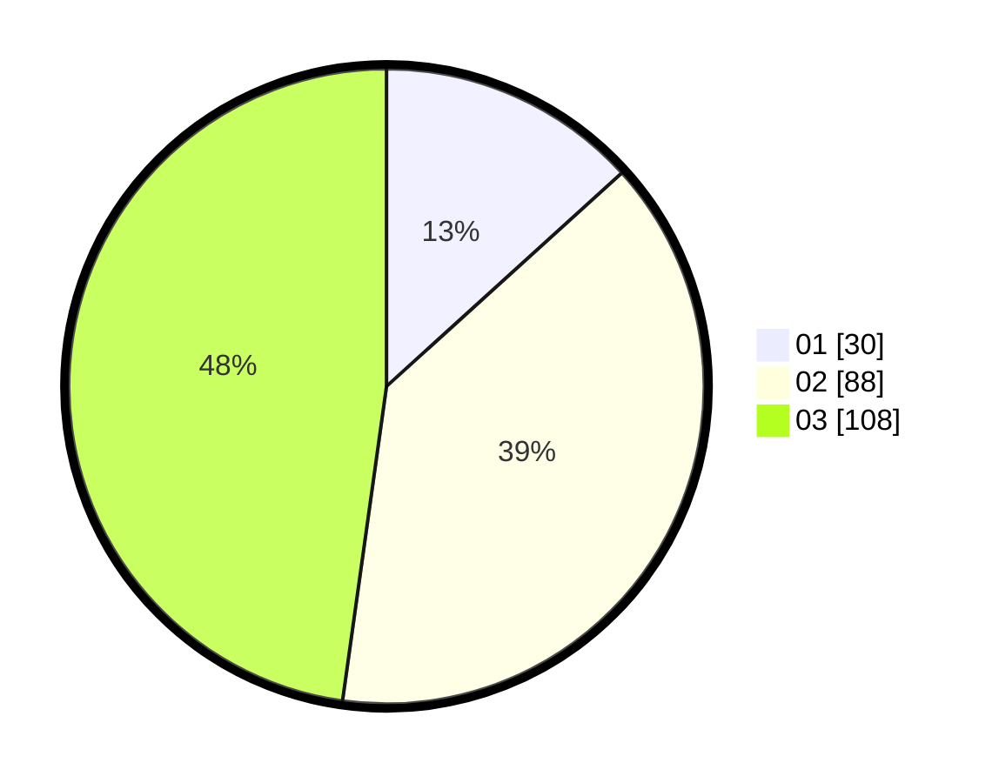

# Hasil

Hasil perolehan suara paslon dapat dilihat pada file paslon-01.txt, paslon-02.txt, dan paslon-03.txt.

Jika tidak ada, artinya data tersebut belum ada pada SIREKAP.

## Perolehan Suara

 * Paslon 01: **30**.
 * Paslon 02: **88**.
 * Paslon 03: **108**.

## Foto C Plano

https://sirekap-obj-formc.kpu.go.id/287e/pemilu/ppwp/31/75/02/10/01/3175021001079-20240216-023009--0cc897db-456d-4475-9430-0509815d8c68.jpg

https://sirekap-obj-formc.kpu.go.id/287e/pemilu/ppwp/31/75/02/10/01/3175021001079-20240216-023013--b8adf382-1d4d-4b64-9785-163cf054e7af.jpg

https://sirekap-obj-formc.kpu.go.id/287e/pemilu/ppwp/31/75/02/10/01/3175021001079-20240216-023012--066f18a1-b182-49c5-8984-c81ed1643852.jpg

## DATA PEMILIH TETAP

Jumlah pemilih dalam DPT: **273**.
 * L: **120**.
 * P: **153**.

## DATA PENGGUNA HAK PILIH

Jumlah pengguna hak pilih dalam DPT: **214**.
 * L: **91**.
 * P: **123**.

Jumlah pengguna hak pilih dalam DPTb: **10**.
 * L: **5**.
 * P: **5**.

Jumlah pengguna hak pilih dalam DPK: **3**.
 * L: **1**.
 * P: **2**.

Jumlah pengguna hak pilih: **227**.
 * L: **97**.
 * P: **130**.

## JUMLAH SUARA SAH DAN TIDAK SAH

JUMLAH SELURUH SUARA SAH: **226**.

JUMLAH SUARA TIDAK SAH: **1**.

JUMLAH SELURUH SUARA SAH DAN SUARA TIDAK SAH: **227**.
