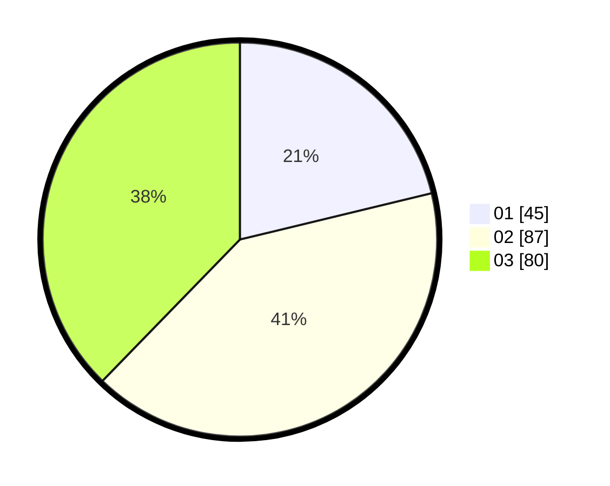

# Hasil

Hasil perolehan suara paslon dapat dilihat pada file paslon-01.txt, paslon-02.txt, dan paslon-03.txt.

Jika tidak ada, artinya data tersebut belum ada pada SIREKAP.

## Perolehan Suara

 * Paslon 01: **45**.
 * Paslon 02: **87**.
 * Paslon 03: **80**.

## Foto C Plano

https://sirekap-obj-formc.kpu.go.id/6a24/pemilu/ppwp/31/75/02/10/01/3175021001081-20240216-004156--6a26d36a-0a8f-444a-ab76-f5c52d5f96b8.jpg

https://sirekap-obj-formc.kpu.go.id/6a24/pemilu/ppwp/31/75/02/10/01/3175021001081-20240216-004157--b2990568-6f19-47ef-958b-a109495b34ae.jpg

https://sirekap-obj-formc.kpu.go.id/6a24/pemilu/ppwp/31/75/02/10/01/3175021001081-20240216-004156--e5865008-faf0-4d91-bc5e-f4ded934fdf2.jpg

## DATA PEMILIH TETAP

Jumlah pemilih dalam DPT: **278**.
 * L: **124**.
 * P: **154**.

## DATA PENGGUNA HAK PILIH

Jumlah pengguna hak pilih dalam DPT: **209**.
 * L: **96**.
 * P: **113**.

Jumlah pengguna hak pilih dalam DPTb: **0**.
 * L: **0**.
 * P: **0**.

Jumlah pengguna hak pilih dalam DPK: **4**.
 * L: **1**.
 * P: **3**.

Jumlah pengguna hak pilih: **213**.
 * L: **97**.
 * P: **116**.

## JUMLAH SUARA SAH DAN TIDAK SAH

JUMLAH SELURUH SUARA SAH: **212**.

JUMLAH SUARA TIDAK SAH: **1**.

JUMLAH SELURUH SUARA SAH DAN SUARA TIDAK SAH: **213**.
