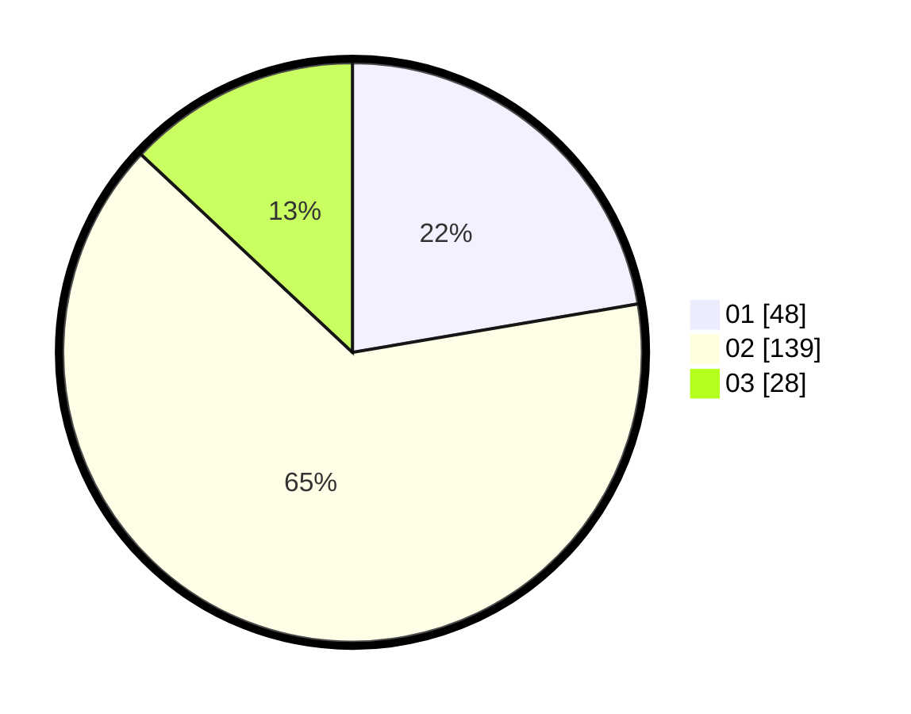

# Hasil

Hasil perolehan suara paslon dapat dilihat pada file paslon-01.txt, paslon-02.txt, dan paslon-03.txt.

Jika tidak ada, artinya data tersebut belum ada pada SIREKAP.

## Perolehan Suara

 * Paslon 01: **48**.
 * Paslon 02: **139**.
 * Paslon 03: **28**.

## Foto C Plano

https://sirekap-obj-formc.kpu.go.id/3535/pemilu/ppwp/31/75/02/10/01/3175021001084-20240216-010926--77a2bd57-5c27-4f52-ac4b-4cd79344a7db.jpg

https://sirekap-obj-formc.kpu.go.id/3535/pemilu/ppwp/31/75/02/10/01/3175021001084-20240216-010929--4ced1595-d6c9-4899-8324-da3ce2458dbe.jpg

https://sirekap-obj-formc.kpu.go.id/3535/pemilu/ppwp/31/75/02/10/01/3175021001084-20240216-010928--3b4abc77-5f04-420d-874e-7bbf603a6269.jpg

## DATA PEMILIH TETAP

Jumlah pemilih dalam DPT: **280**.
 * L: **140**.
 * P: **140**.

## DATA PENGGUNA HAK PILIH

Jumlah pengguna hak pilih dalam DPT: **211**.
 * L: **102**.
 * P: **109**.

Jumlah pengguna hak pilih dalam DPTb: **2**.
 * L: **1**.
 * P: **1**.

Jumlah pengguna hak pilih dalam DPK: **3**.
 * L: **1**.
 * P: **2**.

Jumlah pengguna hak pilih: **216**.
 * L: **104**.
 * P: **112**.

## JUMLAH SUARA SAH DAN TIDAK SAH

JUMLAH SELURUH SUARA SAH: **215**.

JUMLAH SUARA TIDAK SAH: **1**.

JUMLAH SELURUH SUARA SAH DAN SUARA TIDAK SAH: **216**.
