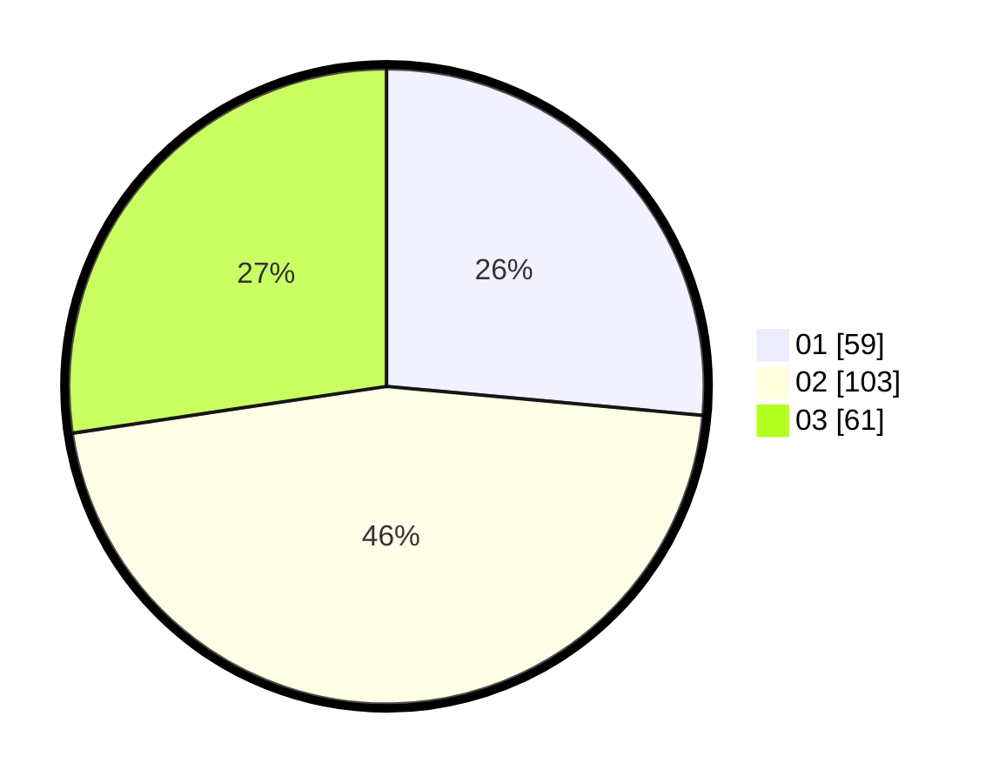

# Hasil

Hasil perolehan suara paslon dapat dilihat pada file paslon-01.txt, paslon-02.txt, dan paslon-03.txt.

Jika tidak ada, artinya data tersebut belum ada pada SIREKAP.

## Perolehan Suara

 * Paslon 01: **59**.
 * Paslon 02: **103**.
 * Paslon 03: **61**.

## Foto C Plano

https://sirekap-obj-formc.kpu.go.id/f98c/pemilu/ppwp/31/75/02/10/01/3175021001087-20240217-213946--1bb8f423-d48b-43d9-8797-8578818aef43.jpg

https://sirekap-obj-formc.kpu.go.id/f98c/pemilu/ppwp/31/75/02/10/01/3175021001087-20240217-213947--eda41448-585e-436a-b9ee-92e8f429ba01.jpg

https://sirekap-obj-formc.kpu.go.id/f98c/pemilu/ppwp/31/75/02/10/01/3175021001087-20240217-213947--9cd1a5cf-6b61-4098-bfd0-e0d565974075.jpg

## DATA PEMILIH TETAP

Jumlah pemilih dalam DPT: **282**.
 * L: **142**.
 * P: **140**.

## DATA PENGGUNA HAK PILIH

Jumlah pengguna hak pilih dalam DPT: **279**.
 * L: **111**.
 * P: **108**.

Jumlah pengguna hak pilih dalam DPTb: **219**.
 * L: **111**.
 * P: **108**.

Jumlah pengguna hak pilih dalam DPK: **0**.
 * L: **0**.
 * P: **0**.

Jumlah pengguna hak pilih: **0**.
 * L: **0**.
 * P: **0**.

## JUMLAH SUARA SAH DAN TIDAK SAH

JUMLAH SELURUH SUARA SAH: **223**.

JUMLAH SUARA TIDAK SAH: **0**.

JUMLAH SELURUH SUARA SAH DAN SUARA TIDAK SAH: **223**.
