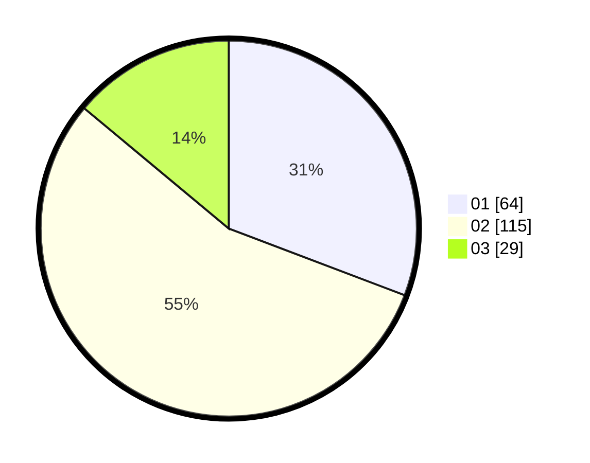

# Hasil

Hasil perolehan suara paslon dapat dilihat pada file paslon-01.txt, paslon-02.txt, dan paslon-03.txt.

Jika tidak ada, artinya data tersebut belum ada pada SIREKAP.

## Perolehan Suara

 * Paslon 01: **64**.
 * Paslon 02: **115**.
 * Paslon 03: **29**.

## Foto C Plano

https://sirekap-obj-formc.kpu.go.id/5c42/pemilu/ppwp/31/75/02/10/01/3175021001090-20240216-050149--84b3a8cf-01c3-49a2-af5e-34cad77ba50f.jpg

https://sirekap-obj-formc.kpu.go.id/5c42/pemilu/ppwp/31/75/02/10/01/3175021001090-20240216-050150--0aed8478-16cc-427d-9f9f-fd2df7ea4203.jpg

https://sirekap-obj-formc.kpu.go.id/5c42/pemilu/ppwp/31/75/02/10/01/3175021001090-20240216-050149--9e2410d7-1560-4adb-8162-95652f01799a.jpg

## DATA PEMILIH TETAP

Jumlah pemilih dalam DPT: **282**.
 * L: **140**.
 * P: **142**.

## DATA PENGGUNA HAK PILIH

Jumlah pengguna hak pilih dalam DPT: **206**.
 * L: **100**.
 * P: **106**.

Jumlah pengguna hak pilih dalam DPTb: **3**.
 * L: **1**.
 * P: **2**.

Jumlah pengguna hak pilih dalam DPK: **0**.
 * L: **0**.
 * P: **0**.

Jumlah pengguna hak pilih: **209**.
 * L: **101**.
 * P: **108**.

## JUMLAH SUARA SAH DAN TIDAK SAH

JUMLAH SELURUH SUARA SAH: **208**.

JUMLAH SUARA TIDAK SAH: **1**.

JUMLAH SELURUH SUARA SAH DAN SUARA TIDAK SAH: **209**.
