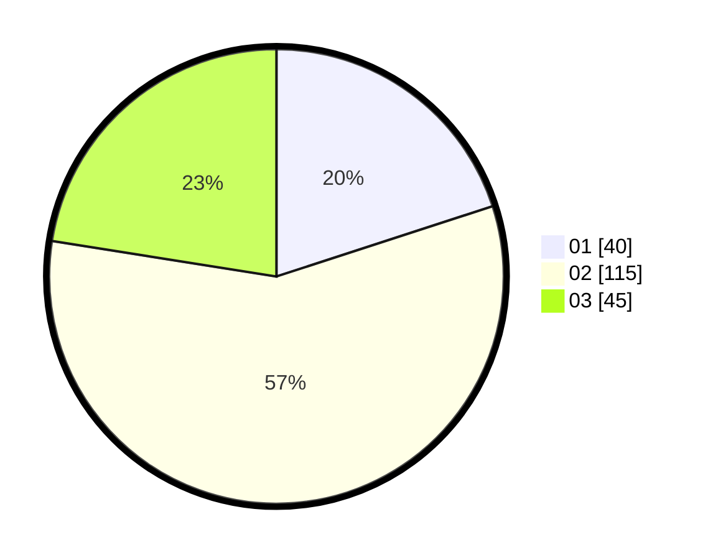

# Hasil

Hasil perolehan suara paslon dapat dilihat pada file paslon-01.txt, paslon-02.txt, dan paslon-03.txt.

Jika tidak ada, artinya data tersebut belum ada pada SIREKAP.

## Perolehan Suara

 * Paslon 01: **40**.
 * Paslon 02: **115**.
 * Paslon 03: **45**.

## Foto C Plano

https://sirekap-obj-formc.kpu.go.id/57b5/pemilu/ppwp/31/75/02/10/01/3175021001093-20240216-150907--4b321965-7165-4e37-924e-3b7ea0fc82b4.jpg

https://sirekap-obj-formc.kpu.go.id/57b5/pemilu/ppwp/31/75/02/10/01/3175021001093-20240216-150909--a8098a09-7a33-43be-a524-60080c21b3cd.jpg

https://sirekap-obj-formc.kpu.go.id/57b5/pemilu/ppwp/31/75/02/10/01/3175021001093-20240216-150908--61b57be8-8c02-4961-9c8e-62cef9110f69.jpg

## DATA PEMILIH TETAP

Jumlah pemilih dalam DPT: **275**.
 * L: **141**.
 * P: **134**.

## DATA PENGGUNA HAK PILIH

Jumlah pengguna hak pilih dalam DPT: **198**.
 * L: **100**.
 * P: **98**.

Jumlah pengguna hak pilih dalam DPTb: **1**.
 * L: **1**.
 * P: **0**.

Jumlah pengguna hak pilih dalam DPK: **3**.
 * L: **2**.
 * P: **1**.

Jumlah pengguna hak pilih: **202**.
 * L: **103**.
 * P: **99**.

## JUMLAH SUARA SAH DAN TIDAK SAH

JUMLAH SELURUH SUARA SAH: **200**.

JUMLAH SUARA TIDAK SAH: **2**.

JUMLAH SELURUH SUARA SAH DAN SUARA TIDAK SAH: **202**.
