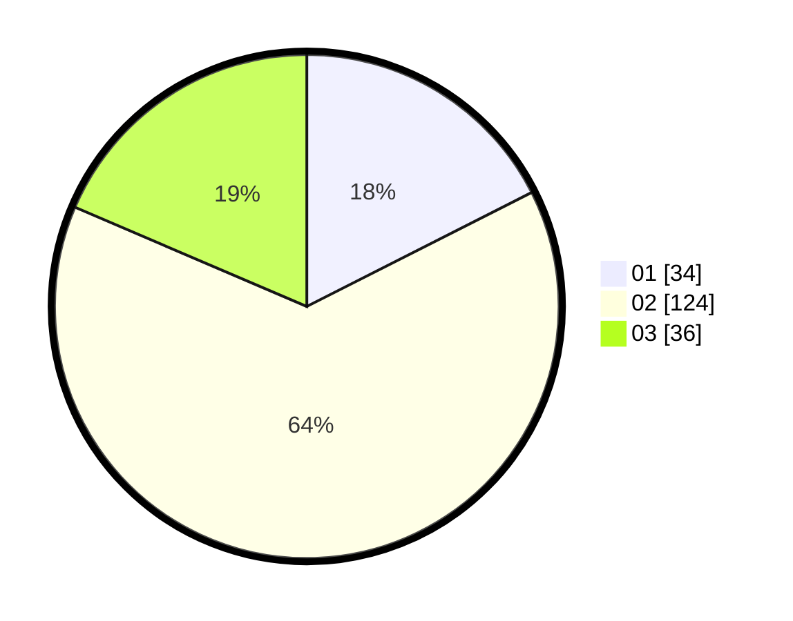

# Hasil

Hasil perolehan suara paslon dapat dilihat pada file paslon-01.txt, paslon-02.txt, dan paslon-03.txt.

Jika tidak ada, artinya data tersebut belum ada pada SIREKAP.

## Perolehan Suara

 * Paslon 01: **34**.
 * Paslon 02: **124**.
 * Paslon 03: **36**.

## Foto C Plano

https://sirekap-obj-formc.kpu.go.id/c4c7/pemilu/ppwp/31/75/02/10/01/3175021001096-20240215-003929--c42d1c57-f1e8-4a51-aeae-5816defbdd2e.jpg

https://sirekap-obj-formc.kpu.go.id/c4c7/pemilu/ppwp/31/75/02/10/01/3175021001096-20240215-004003--8767daf6-3f5d-416f-9acf-a2f54f09667b.jpg

https://sirekap-obj-formc.kpu.go.id/c4c7/pemilu/ppwp/31/75/02/10/01/3175021001096-20240215-004155--41552dfb-d856-4625-8780-b67e9fc811d4.jpg

## DATA PEMILIH TETAP

Jumlah pemilih dalam DPT: **273**.
 * L: **143**.
 * P: **130**.

## DATA PENGGUNA HAK PILIH

Jumlah pengguna hak pilih dalam DPT: **193**.
 * L: **97**.
 * P: **96**.

Jumlah pengguna hak pilih dalam DPTb: **2**.
 * L: **0**.
 * P: **2**.

Jumlah pengguna hak pilih dalam DPK: **0**.
 * L: **0**.
 * P: **0**.

Jumlah pengguna hak pilih: **195**.
 * L: **97**.
 * P: **98**.

## JUMLAH SUARA SAH DAN TIDAK SAH

JUMLAH SELURUH SUARA SAH: **194**.

JUMLAH SUARA TIDAK SAH: **1**.

JUMLAH SELURUH SUARA SAH DAN SUARA TIDAK SAH: **195**.
