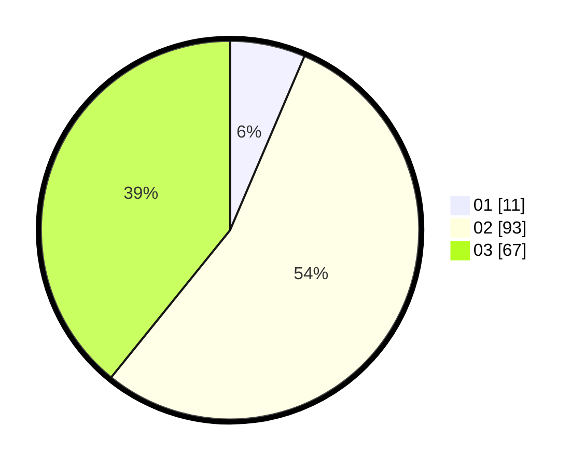

# Hasil

Hasil perolehan suara paslon dapat dilihat pada file paslon-01.txt, paslon-02.txt, dan paslon-03.txt.

Jika tidak ada, artinya data tersebut belum ada pada SIREKAP.

## Perolehan Suara

 * Paslon 01: **11**.
 * Paslon 02: **93**.
 * Paslon 03: **67**.

## Foto C Plano

https://sirekap-obj-formc.kpu.go.id/96c1/pemilu/ppwp/31/75/02/10/01/3175021001099-20240214-235512--2548d3f6-2e51-43fd-855d-7d886d02bdd8.jpg

https://sirekap-obj-formc.kpu.go.id/96c1/pemilu/ppwp/31/75/02/10/01/3175021001099-20240214-235208--9311330a-3780-4bbf-b2d6-f0597dc32ca0.jpg

https://sirekap-obj-formc.kpu.go.id/96c1/pemilu/ppwp/31/75/02/10/01/3175021001099-20240214-234951--3772936a-c2d8-48fd-a4e4-5573950560d4.jpg
