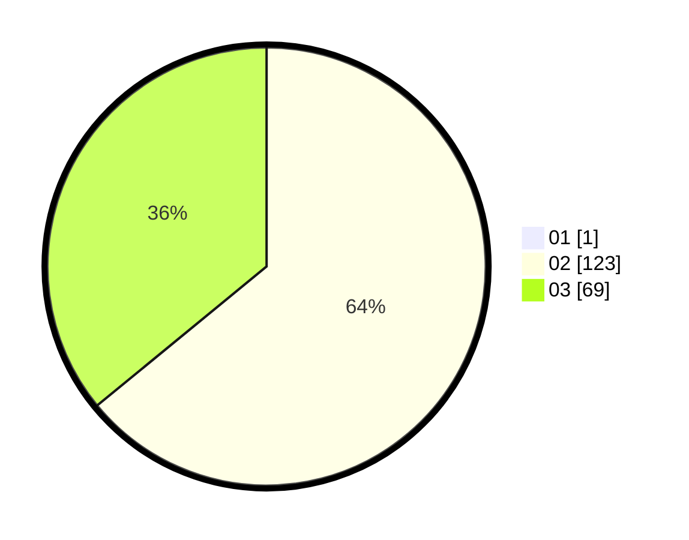

# Hasil

Hasil perolehan suara paslon dapat dilihat pada file paslon-01.txt, paslon-02.txt, dan paslon-03.txt.

Jika tidak ada, artinya data tersebut belum ada pada SIREKAP.

## Perolehan Suara

 * Paslon 01: **1**.
 * Paslon 02: **123**.
 * Paslon 03: **69**.

## Foto C Plano

https://sirekap-obj-formc.kpu.go.id/b992/pemilu/ppwp/31/75/02/10/01/3175021001101-20240216-023839--4458b612-0c8c-4a6a-9f11-32b10e3e9f25.jpg

https://sirekap-obj-formc.kpu.go.id/b992/pemilu/ppwp/31/75/02/10/01/3175021001101-20240214-192513--cd062345-c777-4272-8985-66a6dfa1c0f4.jpg

https://sirekap-obj-formc.kpu.go.id/b992/pemilu/ppwp/31/75/02/10/01/3175021001101-20240216-023839--10f5d909-1786-456d-8dcb-58b771faed71.jpg

## DATA PEMILIH TETAP

Jumlah pemilih dalam DPT: **193**.
 * L: **96**.
 * P: **97**.

## DATA PENGGUNA HAK PILIH

Jumlah pengguna hak pilih dalam DPT: **193**.
 * L: **96**.
 * P: **97**.

Jumlah pengguna hak pilih dalam DPTb: **0**.
 * L: **0**.
 * P: **0**.

Jumlah pengguna hak pilih dalam DPK: **2**.
 * L: **1**.
 * P: **1**.

Jumlah pengguna hak pilih: **195**.
 * L: **97**.
 * P: **98**.

## JUMLAH SUARA SAH DAN TIDAK SAH

JUMLAH SELURUH SUARA SAH: **195**.

JUMLAH SUARA TIDAK SAH: **0**.

JUMLAH SELURUH SUARA SAH DAN SUARA TIDAK SAH: **195**.
