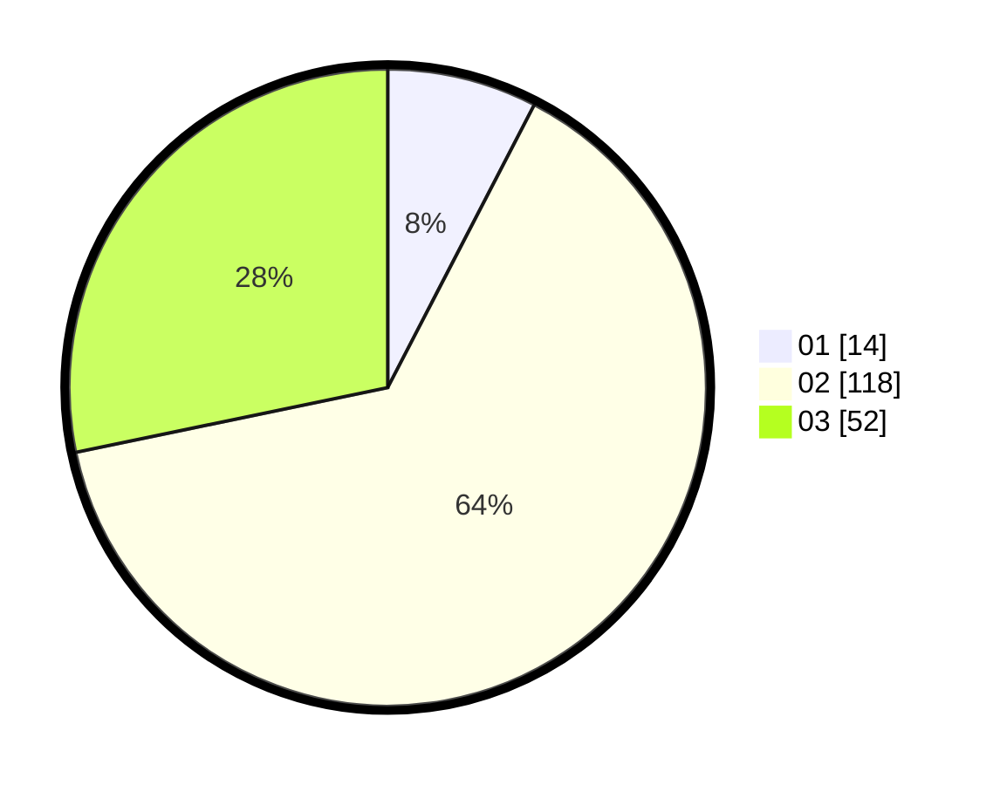

# Hasil

Hasil perolehan suara paslon dapat dilihat pada file paslon-01.txt, paslon-02.txt, dan paslon-03.txt.

Jika tidak ada, artinya data tersebut belum ada pada SIREKAP.

## Perolehan Suara

 * Paslon 01: **14**.
 * Paslon 02: **118**.
 * Paslon 03: **52**.

## Foto C Plano

https://sirekap-obj-formc.kpu.go.id/78d3/pemilu/ppwp/31/75/02/10/01/3175021001104-20240214-231949--ff5e257a-3991-44e3-a1ee-eb6778e475ee.jpg

https://sirekap-obj-formc.kpu.go.id/78d3/pemilu/ppwp/31/75/02/10/01/3175021001104-20240214-232043--de49daa3-1654-4209-8757-11254aeea89c.jpg

https://sirekap-obj-formc.kpu.go.id/78d3/pemilu/ppwp/31/75/02/10/01/3175021001104-20240214-232106--5b176cea-da6c-4dd5-850c-60103a667b21.jpg
