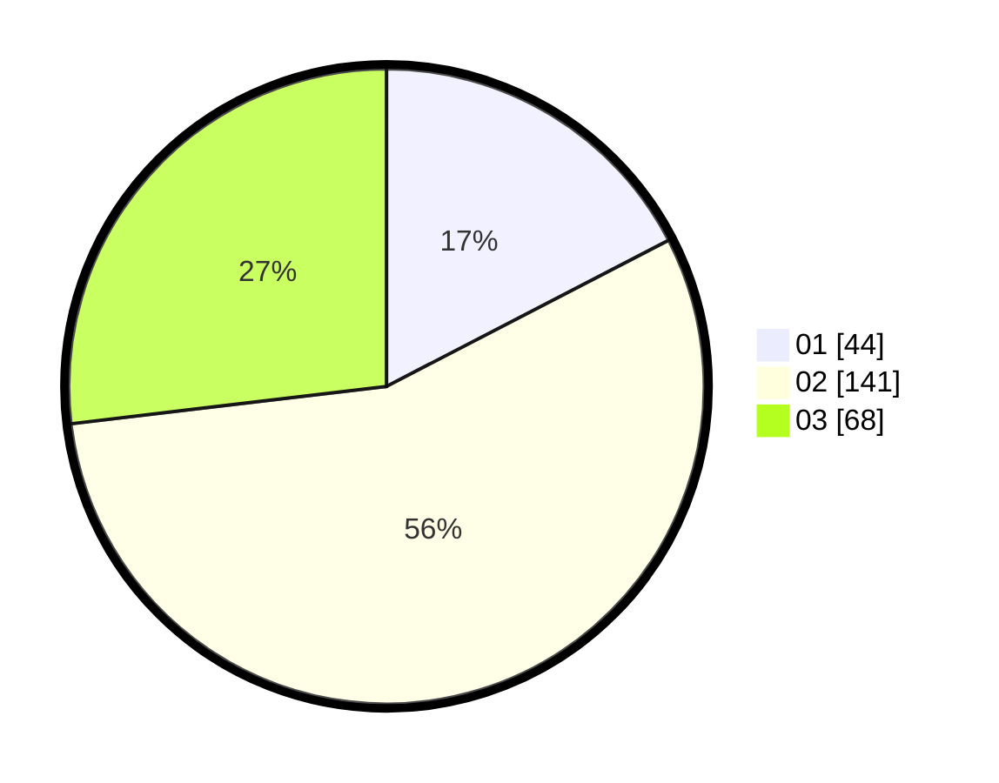

# Hasil

Hasil perolehan suara paslon dapat dilihat pada file paslon-01.txt, paslon-02.txt, dan paslon-03.txt.

Jika tidak ada, artinya data tersebut belum ada pada SIREKAP.

## Perolehan Suara

 * Paslon 01: **44**.
 * Paslon 02: **141**.
 * Paslon 03: **68**.

## Foto C Plano

https://sirekap-obj-formc.kpu.go.id/4324/pemilu/ppwp/31/75/02/10/01/3175021001108-20240214-230150--b727ec48-86f3-422d-b50b-9d9fb088413d.jpg

https://sirekap-obj-formc.kpu.go.id/4324/pemilu/ppwp/31/75/02/10/01/3175021001108-20240214-230229--cd65f6cf-66c9-49e3-8d5f-993b89015476.jpg

https://sirekap-obj-formc.kpu.go.id/4324/pemilu/ppwp/31/75/02/10/01/3175021001108-20240214-230304--2e9fb094-dbcb-46e8-b39d-a18678080386.jpg
