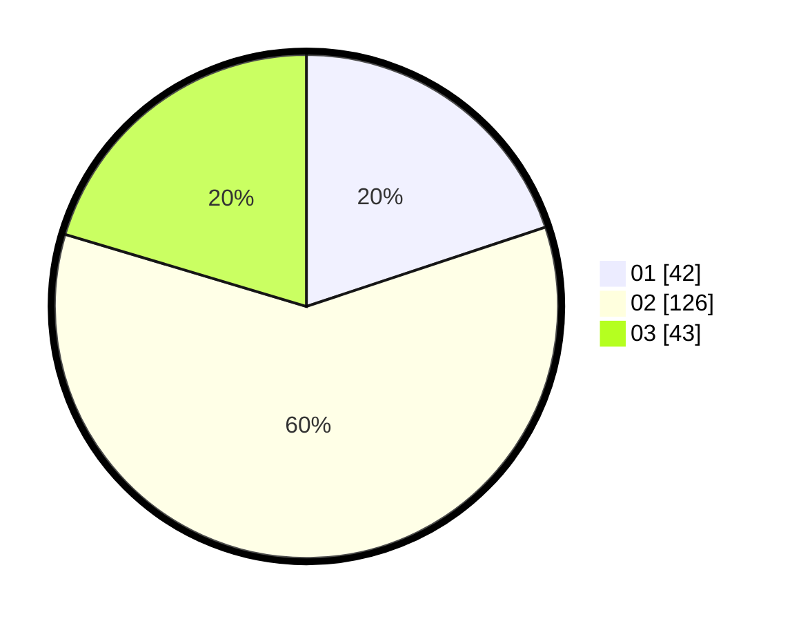

# Hasil

Hasil perolehan suara paslon dapat dilihat pada file paslon-01.txt, paslon-02.txt, dan paslon-03.txt.

Jika tidak ada, artinya data tersebut belum ada pada SIREKAP.

## Perolehan Suara

 * Paslon 01: **42**.
 * Paslon 02: **126**.
 * Paslon 03: **43**.

## Foto C Plano

https://sirekap-obj-formc.kpu.go.id/d527/pemilu/ppwp/31/75/02/10/01/3175021001110-20240215-175723--e27c4be6-411e-4479-91d2-2a86242f9e0a.jpg

https://sirekap-obj-formc.kpu.go.id/d527/pemilu/ppwp/31/75/02/10/01/3175021001110-20240215-175748--49390ff7-6883-4530-b784-ac169e9df463.jpg

https://sirekap-obj-formc.kpu.go.id/d527/pemilu/ppwp/31/75/02/10/01/3175021001110-20240215-175734--c4c0b42e-f7da-4e8e-83b8-cd3b68fce4a5.jpg

## DATA PEMILIH TETAP

Jumlah pemilih dalam DPT: **267**.
 * L: **149**.
 * P: **118**.

## DATA PENGGUNA HAK PILIH

Jumlah pengguna hak pilih dalam DPT: **212**.
 * L: **116**.
 * P: **96**.

Jumlah pengguna hak pilih dalam DPTb: **0**.
 * L: **0**.
 * P: **0**.

Jumlah pengguna hak pilih dalam DPK: **0**.
 * L: **0**.
 * P: **0**.

Jumlah pengguna hak pilih: **212**.
 * L: **116**.
 * P: **96**.

## JUMLAH SUARA SAH DAN TIDAK SAH

JUMLAH SELURUH SUARA SAH: **211**.

JUMLAH SUARA TIDAK SAH: **1**.

JUMLAH SELURUH SUARA SAH DAN SUARA TIDAK SAH: **212**.
