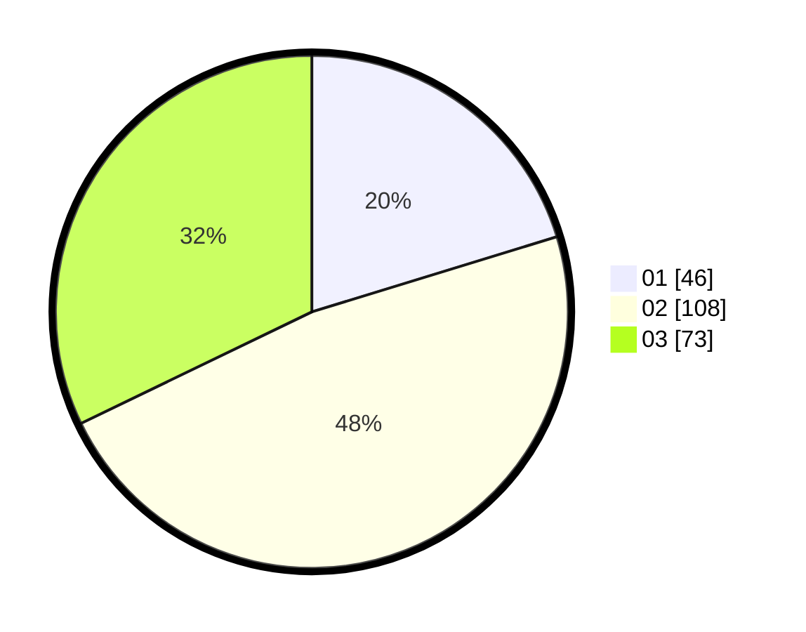

# Hasil

Hasil perolehan suara paslon dapat dilihat pada file paslon-01.txt, paslon-02.txt, dan paslon-03.txt.

Jika tidak ada, artinya data tersebut belum ada pada SIREKAP.

## Perolehan Suara

 * Paslon 01: **46**.
 * Paslon 02: **108**.
 * Paslon 03: **73**.

## Foto C Plano

https://sirekap-obj-formc.kpu.go.id/50de/pemilu/ppwp/31/75/02/10/01/3175021001115-20240216-073300--ae937ff0-128c-477a-bfdb-644f6c5a0a77.jpg

https://sirekap-obj-formc.kpu.go.id/50de/pemilu/ppwp/31/75/02/10/01/3175021001115-20240216-073307--1f68d9e7-f7dd-43a0-8f88-7efaae90f2bf.jpg

https://sirekap-obj-formc.kpu.go.id/50de/pemilu/ppwp/31/75/02/10/01/3175021001115-20240216-073301--d8cff0f4-c00d-4db0-ba09-6c95c9a7753b.jpg

## DATA PEMILIH TETAP

Jumlah pemilih dalam DPT: **286**.
 * L: **142**.
 * P: **144**.

## DATA PENGGUNA HAK PILIH

Jumlah pengguna hak pilih dalam DPT: **189**.
 * L: **91**.
 * P: **98**.

Jumlah pengguna hak pilih dalam DPTb: **32**.
 * L: **14**.
 * P: **18**.

Jumlah pengguna hak pilih dalam DPK: **11**.
 * L: **5**.
 * P: **6**.

Jumlah pengguna hak pilih: **232**.
 * L: **111**.
 * P: **123**.

## JUMLAH SUARA SAH DAN TIDAK SAH

JUMLAH SELURUH SUARA SAH: **227**.

JUMLAH SUARA TIDAK SAH: **5**.

JUMLAH SELURUH SUARA SAH DAN SUARA TIDAK SAH: **232**.
