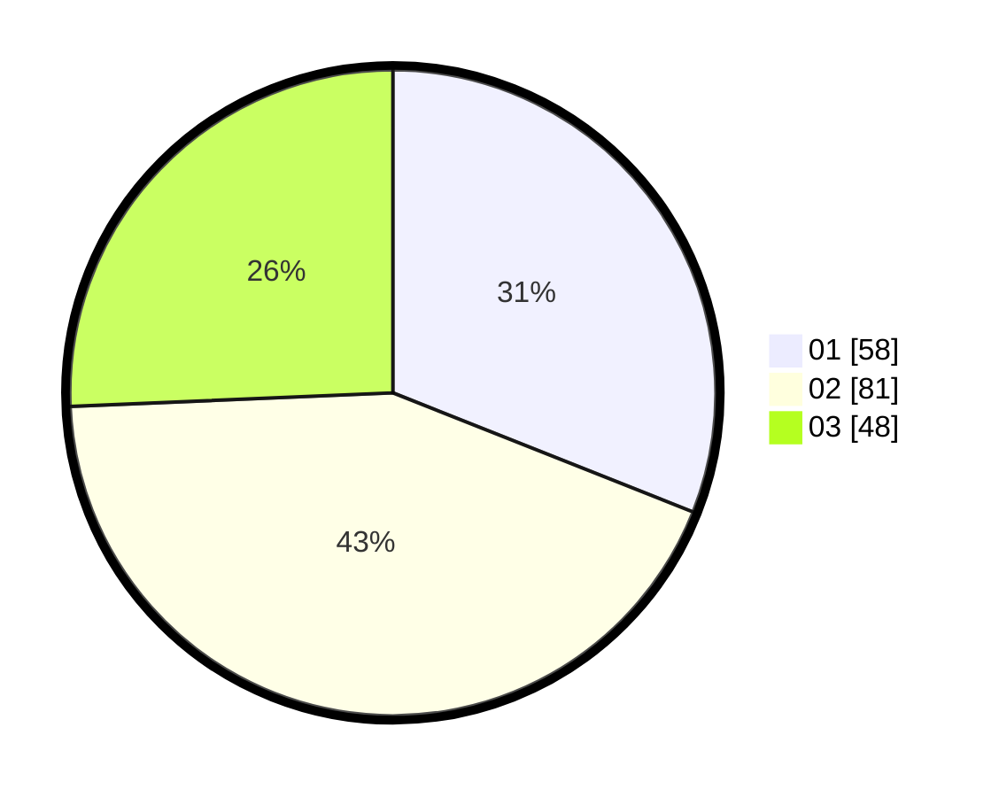

# Hasil

Hasil perolehan suara paslon dapat dilihat pada file paslon-01.txt, paslon-02.txt, dan paslon-03.txt.

Jika tidak ada, artinya data tersebut belum ada pada SIREKAP.

## Perolehan Suara

 * Paslon 01: **58**.
 * Paslon 02: **81**.
 * Paslon 03: **48**.

## Foto C Plano

https://sirekap-obj-formc.kpu.go.id/8c51/pemilu/ppwp/31/75/02/10/02/3175021002001-20240216-115606--327cf473-e95c-4128-95b8-6a7e18258fee.jpg

https://sirekap-obj-formc.kpu.go.id/8c51/pemilu/ppwp/31/75/02/10/02/3175021002001-20240216-115612--1f34cc7c-44de-4c2d-b5b9-2e88afac98f3.jpg

https://sirekap-obj-formc.kpu.go.id/8c51/pemilu/ppwp/31/75/02/10/02/3175021002001-20240216-115610--0fb648d0-d2dd-49e3-ac42-2143a7aa8783.jpg

## DATA PEMILIH TETAP

Jumlah pemilih dalam DPT: **0**.
 * L: **0**.
 * P: **0**.

## DATA PENGGUNA HAK PILIH

Jumlah pengguna hak pilih dalam DPT: **0**.
 * L: **0**.
 * P: **0**.

Jumlah pengguna hak pilih dalam DPTb: **0**.
 * L: **0**.
 * P: **0**.

Jumlah pengguna hak pilih dalam DPK: **0**.
 * L: **0**.
 * P: **0**.

Jumlah pengguna hak pilih: **0**.
 * L: **0**.
 * P: **0**.

## JUMLAH SUARA SAH DAN TIDAK SAH

JUMLAH SELURUH SUARA SAH: **187**.

JUMLAH SUARA TIDAK SAH: **7**.

JUMLAH SELURUH SUARA SAH DAN SUARA TIDAK SAH: **194**.
