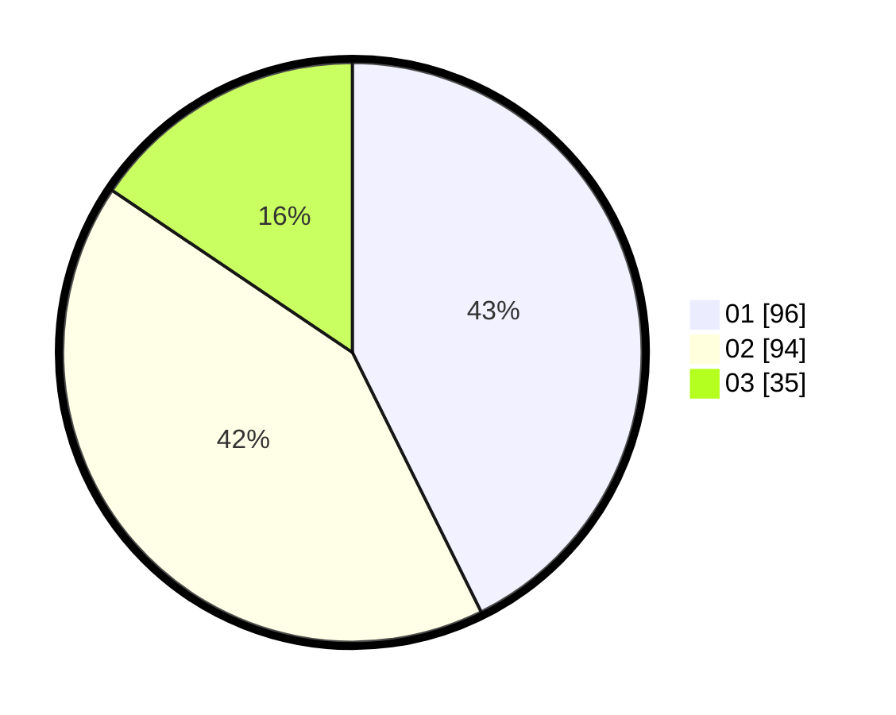

# Hasil

Hasil perolehan suara paslon dapat dilihat pada file paslon-01.txt, paslon-02.txt, dan paslon-03.txt.

Jika tidak ada, artinya data tersebut belum ada pada SIREKAP.

## Perolehan Suara

 * Paslon 01: **96**.
 * Paslon 02: **94**.
 * Paslon 03: **35**.

## Foto C Plano

https://sirekap-obj-formc.kpu.go.id/1bd0/pemilu/ppwp/31/75/02/10/02/3175021002005-20240216-033305--8eeeb84a-8f70-4cdf-8975-76a8cd98940e.jpg

https://sirekap-obj-formc.kpu.go.id/1bd0/pemilu/ppwp/31/75/02/10/02/3175021002005-20240216-033307--b96b8d95-cc6c-4890-ba1e-493f2583cfc7.jpg

https://sirekap-obj-formc.kpu.go.id/1bd0/pemilu/ppwp/31/75/02/10/02/3175021002005-20240216-033306--f0cc9bfb-4921-4dc8-96e6-2a17f8e1cb3e.jpg

## DATA PEMILIH TETAP

Jumlah pemilih dalam DPT: **289**.
 * L: **139**.
 * P: **150**.

## DATA PENGGUNA HAK PILIH

Jumlah pengguna hak pilih dalam DPT: **224**.
 * L: **101**.
 * P: **123**.

Jumlah pengguna hak pilih dalam DPTb: **1**.
 * L: **1**.
 * P: **0**.

Jumlah pengguna hak pilih dalam DPK: **2**.
 * L: **2**.
 * P: **0**.

Jumlah pengguna hak pilih: **227**.
 * L: **104**.
 * P: **123**.

## JUMLAH SUARA SAH DAN TIDAK SAH

JUMLAH SELURUH SUARA SAH: **225**.

JUMLAH SUARA TIDAK SAH: **2**.

JUMLAH SELURUH SUARA SAH DAN SUARA TIDAK SAH: **227**.
