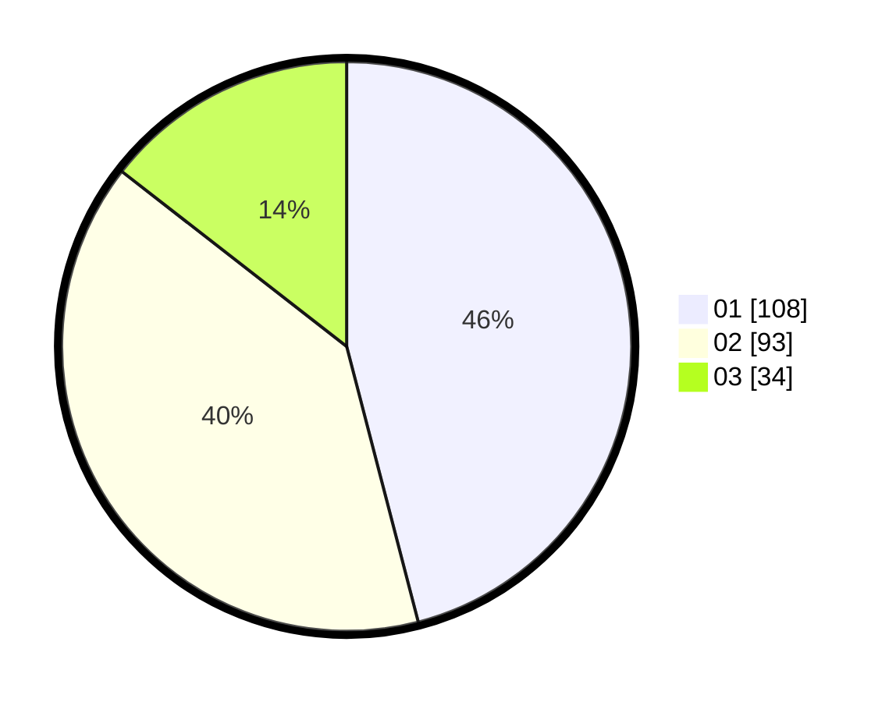

# Hasil

Hasil perolehan suara paslon dapat dilihat pada file paslon-01.txt, paslon-02.txt, dan paslon-03.txt.

Jika tidak ada, artinya data tersebut belum ada pada SIREKAP.

## Perolehan Suara

 * Paslon 01: **108**.
 * Paslon 02: **93**.
 * Paslon 03: **34**.

## Foto C Plano

https://sirekap-obj-formc.kpu.go.id/7e0a/pemilu/ppwp/31/75/02/10/02/3175021002007-20240217-202539--933bdbe2-b8a2-4d93-8457-b681178cca53.jpg

https://sirekap-obj-formc.kpu.go.id/7e0a/pemilu/ppwp/31/75/02/10/02/3175021002007-20240215-022433--ebafe69c-47a4-4377-ac75-0af913135cde.jpg

https://sirekap-obj-formc.kpu.go.id/7e0a/pemilu/ppwp/31/75/02/10/02/3175021002007-20240215-022615--423b4de5-c662-4008-bba4-8ca3b685e4d2.jpg
