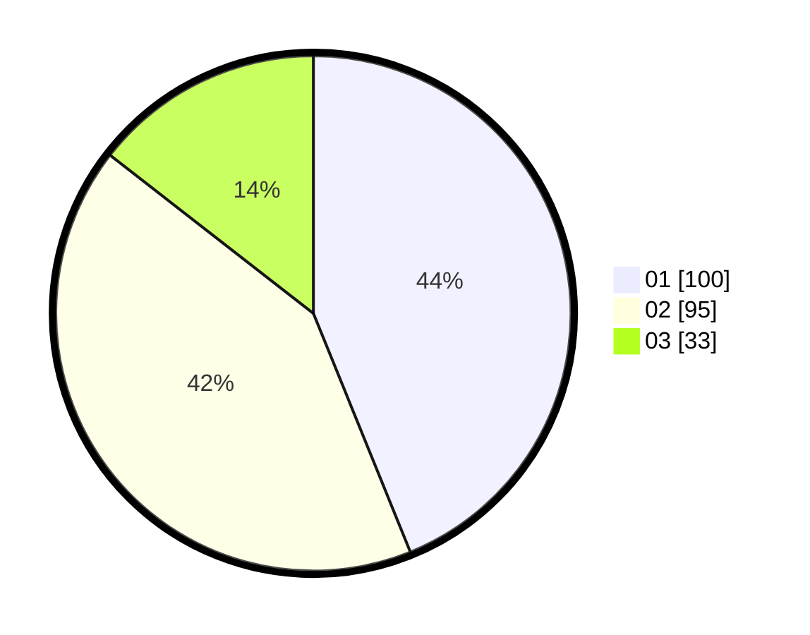

# Hasil

Hasil perolehan suara paslon dapat dilihat pada file paslon-01.txt, paslon-02.txt, dan paslon-03.txt.

Jika tidak ada, artinya data tersebut belum ada pada SIREKAP.

## Perolehan Suara

 * Paslon 01: **100**.
 * Paslon 02: **95**.
 * Paslon 03: **33**.

## Foto C Plano

https://sirekap-obj-formc.kpu.go.id/0f51/pemilu/ppwp/31/75/02/10/02/3175021002010-20240214-193137--75c35d36-90dc-4710-8fa6-f2afac843b83.jpg

https://sirekap-obj-formc.kpu.go.id/0f51/pemilu/ppwp/31/75/02/10/02/3175021002010-20240214-192952--a6c40efd-b536-4637-ab7c-55c98f7096ce.jpg

https://sirekap-obj-formc.kpu.go.id/0f51/pemilu/ppwp/31/75/02/10/02/3175021002010-20240214-193224--0e8bb98a-c074-4afd-a337-692cc799f981.jpg

## DATA PEMILIH TETAP

Jumlah pemilih dalam DPT: **257**.
 * L: **141**.
 * P: **150**.

## DATA PENGGUNA HAK PILIH

Jumlah pengguna hak pilih dalam DPT: **226**.
 * L: **108**.
 * P: **118**.

Jumlah pengguna hak pilih dalam DPTb: **2**.
 * L: **1**.
 * P: **1**.

Jumlah pengguna hak pilih dalam DPK: **5**.
 * L: **3**.
 * P: **2**.

Jumlah pengguna hak pilih: **223**.
 * L: **112**.
 * P: **121**.

## JUMLAH SUARA SAH DAN TIDAK SAH

JUMLAH SELURUH SUARA SAH: **228**.

JUMLAH SUARA TIDAK SAH: **5**.

JUMLAH SELURUH SUARA SAH DAN SUARA TIDAK SAH: **233**.
