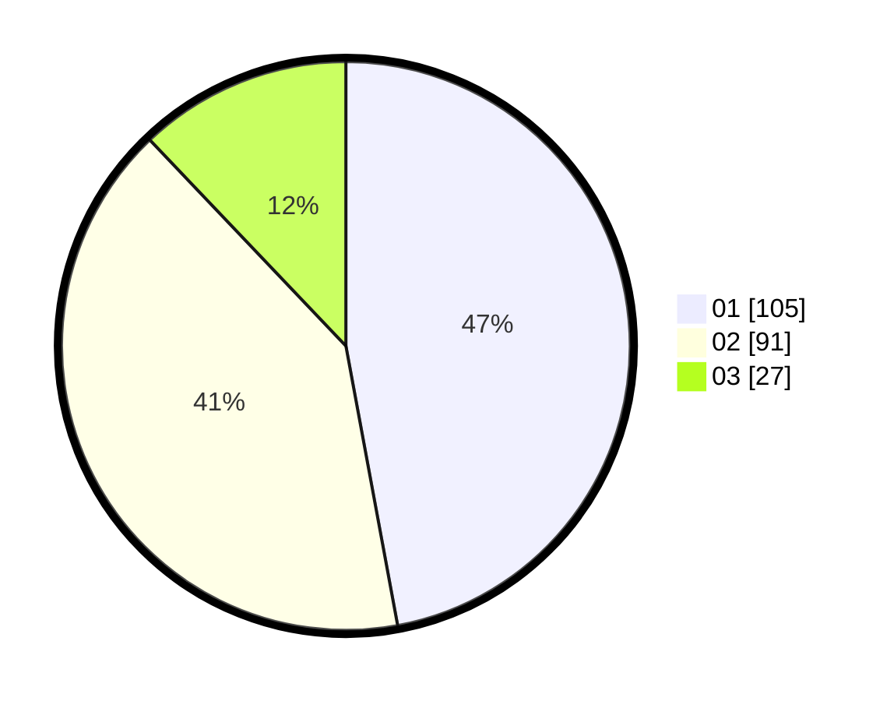

# Hasil

Hasil perolehan suara paslon dapat dilihat pada file paslon-01.txt, paslon-02.txt, dan paslon-03.txt.

Jika tidak ada, artinya data tersebut belum ada pada SIREKAP.

## Perolehan Suara

 * Paslon 01: **105**.
 * Paslon 02: **91**.
 * Paslon 03: **27**.

## Foto C Plano

https://sirekap-obj-formc.kpu.go.id/02e4/pemilu/ppwp/31/75/02/10/02/3175021002012-20240214-155338--dd98d150-6f1a-461a-95a8-98ae7888cba9.jpg

https://sirekap-obj-formc.kpu.go.id/02e4/pemilu/ppwp/31/75/02/10/02/3175021002012-20240214-155525--5fb898c8-df04-4133-83de-ebf61844eac3.jpg

https://sirekap-obj-formc.kpu.go.id/02e4/pemilu/ppwp/31/75/02/10/02/3175021002012-20240216-025341--3e8f3307-8c31-4d50-a6b9-16e88ddbcf1a.jpg

## DATA PEMILIH TETAP

Jumlah pemilih dalam DPT: **278**.
 * L: **145**.
 * P: **133**.

## DATA PENGGUNA HAK PILIH

Jumlah pengguna hak pilih dalam DPT: **223**.
 * L: **111**.
 * P: **112**.

Jumlah pengguna hak pilih dalam DPTb: **4**.
 * L: **3**.
 * P: **1**.

Jumlah pengguna hak pilih dalam DPK: **0**.
 * L: **0**.
 * P: **0**.

Jumlah pengguna hak pilih: **227**.
 * L: **114**.
 * P: **113**.

## JUMLAH SUARA SAH DAN TIDAK SAH

JUMLAH SELURUH SUARA SAH: **223**.

JUMLAH SUARA TIDAK SAH: **4**.

JUMLAH SELURUH SUARA SAH DAN SUARA TIDAK SAH: **227**.
