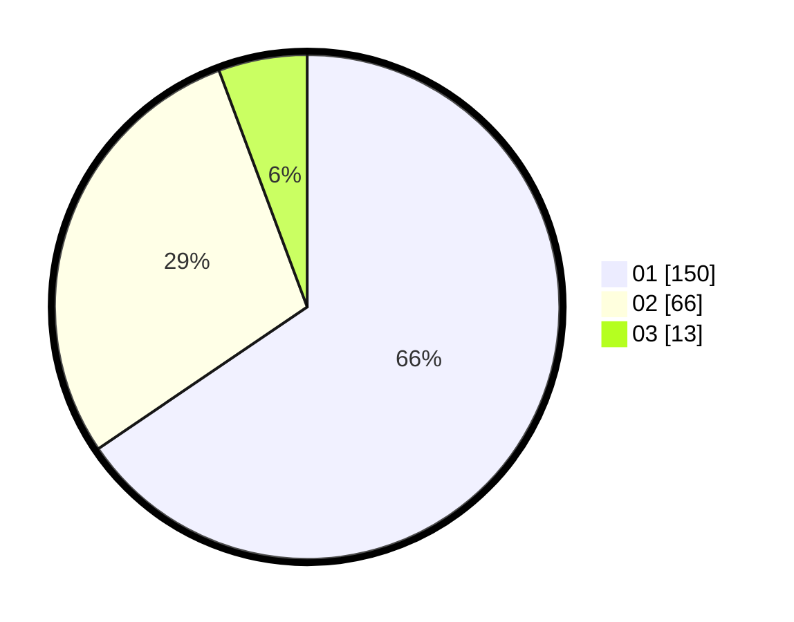

# Hasil

Hasil perolehan suara paslon dapat dilihat pada file paslon-01.txt, paslon-02.txt, dan paslon-03.txt.

Jika tidak ada, artinya data tersebut belum ada pada SIREKAP.

## Perolehan Suara

 * Paslon 01: **150**.
 * Paslon 02: **66**.
 * Paslon 03: **13**.

## Foto C Plano

https://sirekap-obj-formc.kpu.go.id/a708/pemilu/ppwp/31/75/02/10/02/3175021002013-20240215-020442--0df45d17-2c04-4756-a77d-4c8343a4488e.jpg

https://sirekap-obj-formc.kpu.go.id/a708/pemilu/ppwp/31/75/02/10/02/3175021002013-20240215-020343--9f987b82-0945-4474-adfd-b59c55391923.jpg

https://sirekap-obj-formc.kpu.go.id/a708/pemilu/ppwp/31/75/02/10/02/3175021002013-20240215-020535--6f7efaa8-1c2a-4d03-8e8c-634837fbf48f.jpg

## DATA PEMILIH TETAP

Jumlah pemilih dalam DPT: **229**.
 * L: **108**.
 * P: **121**.

## DATA PENGGUNA HAK PILIH

Jumlah pengguna hak pilih dalam DPT: **229**.
 * L: **108**.
 * P: **121**.

Jumlah pengguna hak pilih dalam DPTb: **2**.
 * L: **2**.
 * P: **0**.

Jumlah pengguna hak pilih dalam DPK: **0**.
 * L: **0**.
 * P: **0**.

Jumlah pengguna hak pilih: **231**.
 * L: **110**.
 * P: **121**.

## JUMLAH SUARA SAH DAN TIDAK SAH

JUMLAH SELURUH SUARA SAH: **229**.

JUMLAH SUARA TIDAK SAH: **2**.

JUMLAH SELURUH SUARA SAH DAN SUARA TIDAK SAH: **231**.
