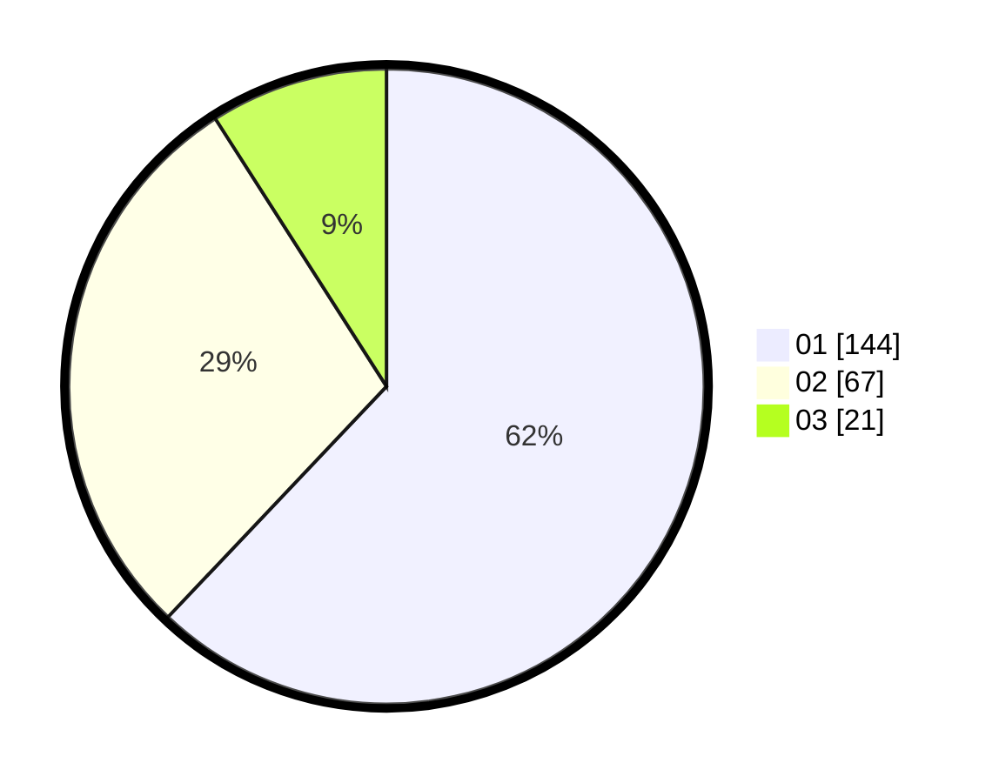

# Hasil

Hasil perolehan suara paslon dapat dilihat pada file paslon-01.txt, paslon-02.txt, dan paslon-03.txt.

Jika tidak ada, artinya data tersebut belum ada pada SIREKAP.

## Perolehan Suara

 * Paslon 01: **144**.
 * Paslon 02: **67**.
 * Paslon 03: **21**.

## Foto C Plano

https://sirekap-obj-formc.kpu.go.id/0bfe/pemilu/ppwp/31/75/02/10/02/3175021002014-20240214-185958--eaf5fb5d-5ad0-4772-a68b-e645ac044741.jpg

https://sirekap-obj-formc.kpu.go.id/0bfe/pemilu/ppwp/31/75/02/10/02/3175021002014-20240214-191503--496c2263-f3fc-4d82-937c-66594d839655.jpg

https://sirekap-obj-formc.kpu.go.id/0bfe/pemilu/ppwp/31/75/02/10/02/3175021002014-20240214-193236--07abc493-5cca-4355-b193-08c3d5edfed9.jpg

## DATA PEMILIH TETAP

Jumlah pemilih dalam DPT: **291**.
 * L: **153**.
 * P: **138**.

## DATA PENGGUNA HAK PILIH

Jumlah pengguna hak pilih dalam DPT: **229**.
 * L: **118**.
 * P: **111**.

Jumlah pengguna hak pilih dalam DPTb: **3**.
 * L: **1**.
 * P: **2**.

Jumlah pengguna hak pilih dalam DPK: **0**.
 * L: **0**.
 * P: **0**.

Jumlah pengguna hak pilih: **232**.
 * L: **119**.
 * P: **113**.

## JUMLAH SUARA SAH DAN TIDAK SAH

JUMLAH SELURUH SUARA SAH: **232**.

JUMLAH SUARA TIDAK SAH: **0**.

JUMLAH SELURUH SUARA SAH DAN SUARA TIDAK SAH: **232**.
