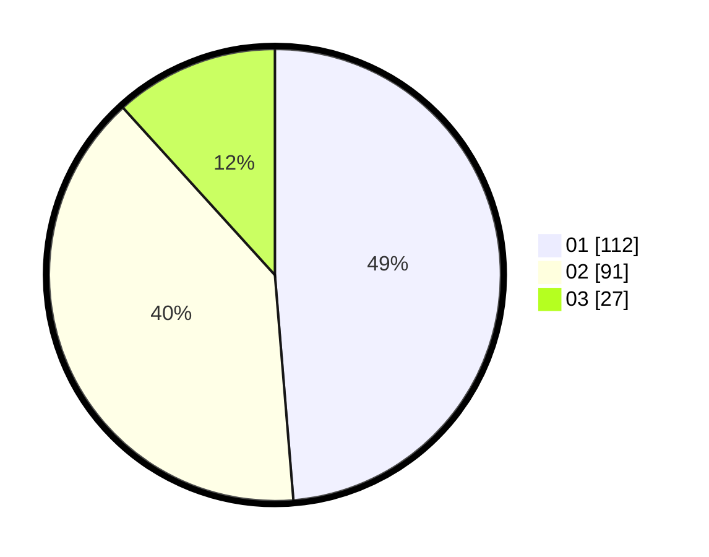

# Hasil

Hasil perolehan suara paslon dapat dilihat pada file paslon-01.txt, paslon-02.txt, dan paslon-03.txt.

Jika tidak ada, artinya data tersebut belum ada pada SIREKAP.

## Perolehan Suara

 * Paslon 01: **112**.
 * Paslon 02: **91**.
 * Paslon 03: **27**.

## Foto C Plano

https://sirekap-obj-formc.kpu.go.id/0661/pemilu/ppwp/31/75/02/10/02/3175021002016-20240214-205810--5c8b09ef-60fc-4e71-b53a-ad971e80c051.jpg

https://sirekap-obj-formc.kpu.go.id/0661/pemilu/ppwp/31/75/02/10/02/3175021002016-20240214-210250--9bc8d968-31f9-4b6e-a054-5116579c23b3.jpg

https://sirekap-obj-formc.kpu.go.id/0661/pemilu/ppwp/31/75/02/10/02/3175021002016-20240214-210508--dde9fa63-90a5-489d-abde-da1dc5bfeb0e.jpg
