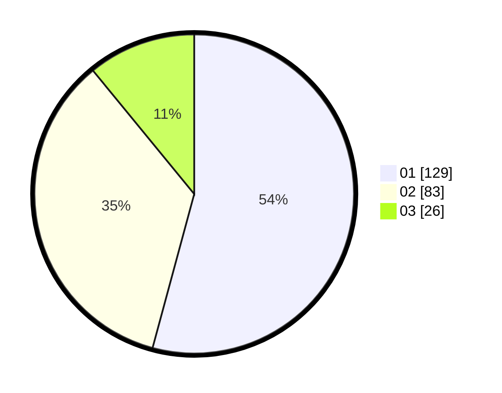

# Hasil

Hasil perolehan suara paslon dapat dilihat pada file paslon-01.txt, paslon-02.txt, dan paslon-03.txt.

Jika tidak ada, artinya data tersebut belum ada pada SIREKAP.

## Perolehan Suara

 * Paslon 01: **129**.
 * Paslon 02: **83**.
 * Paslon 03: **26**.

## Foto C Plano

https://sirekap-obj-formc.kpu.go.id/ae27/pemilu/ppwp/31/75/02/10/02/3175021002018-20240215-213317--b2e2cd2d-64c1-49ec-8828-a3715937ace3.jpg

https://sirekap-obj-formc.kpu.go.id/ae27/pemilu/ppwp/31/75/02/10/02/3175021002018-20240214-200101--39b11881-a710-4288-9562-9bf828a827fb.jpg

https://sirekap-obj-formc.kpu.go.id/ae27/pemilu/ppwp/31/75/02/10/02/3175021002018-20240215-213319--e858d1bf-1c14-49a0-9035-da29027b8092.jpg

## DATA PEMILIH TETAP

Jumlah pemilih dalam DPT: **287**.
 * L: **140**.
 * P: **147**.

## DATA PENGGUNA HAK PILIH

Jumlah pengguna hak pilih dalam DPT: **234**.
 * L: **111**.
 * P: **123**.

Jumlah pengguna hak pilih dalam DPTb: **4**.
 * L: **3**.
 * P: **1**.

Jumlah pengguna hak pilih dalam DPK: **0**.
 * L: **0**.
 * P: **0**.

Jumlah pengguna hak pilih: **238**.
 * L: **114**.
 * P: **124**.

## JUMLAH SUARA SAH DAN TIDAK SAH

JUMLAH SELURUH SUARA SAH: **238**.

JUMLAH SUARA TIDAK SAH: **0**.

JUMLAH SELURUH SUARA SAH DAN SUARA TIDAK SAH: **238**.
