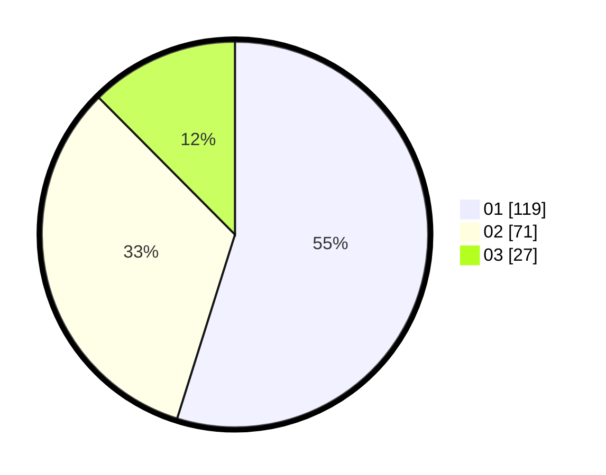

# Hasil

Hasil perolehan suara paslon dapat dilihat pada file paslon-01.txt, paslon-02.txt, dan paslon-03.txt.

Jika tidak ada, artinya data tersebut belum ada pada SIREKAP.

## Perolehan Suara

 * Paslon 01: **119**.
 * Paslon 02: **71**.
 * Paslon 03: **27**.

## Foto C Plano

https://sirekap-obj-formc.kpu.go.id/c21a/pemilu/ppwp/31/75/02/10/02/3175021002019-20240215-232339--e98e64fc-aa90-4a8e-81ef-bf7450b1bccb.jpg

https://sirekap-obj-formc.kpu.go.id/c21a/pemilu/ppwp/31/75/02/10/02/3175021002019-20240215-232350--95ce6109-19e0-4a6a-9a57-f5c8efb6a293.jpg

https://sirekap-obj-formc.kpu.go.id/c21a/pemilu/ppwp/31/75/02/10/02/3175021002019-20240215-232346--c29bc3e8-f579-48cf-9846-4f4dbdde23db.jpg

## DATA PEMILIH TETAP

Jumlah pemilih dalam DPT: **291**.
 * L: **145**.
 * P: **146**.

## DATA PENGGUNA HAK PILIH

Jumlah pengguna hak pilih dalam DPT: **216**.
 * L: **100**.
 * P: **116**.

Jumlah pengguna hak pilih dalam DPTb: **2**.
 * L: **1**.
 * P: **1**.

Jumlah pengguna hak pilih dalam DPK: **0**.
 * L: **0**.
 * P: **0**.

Jumlah pengguna hak pilih: **218**.
 * L: **101**.
 * P: **117**.

## JUMLAH SUARA SAH DAN TIDAK SAH

JUMLAH SELURUH SUARA SAH: **217**.

JUMLAH SUARA TIDAK SAH: **3**.

JUMLAH SELURUH SUARA SAH DAN SUARA TIDAK SAH: **220**.
