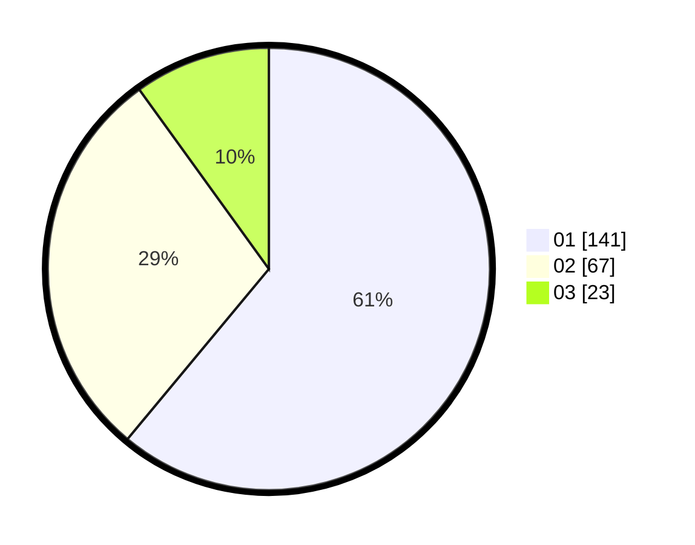

# Hasil

Hasil perolehan suara paslon dapat dilihat pada file paslon-01.txt, paslon-02.txt, dan paslon-03.txt.

Jika tidak ada, artinya data tersebut belum ada pada SIREKAP.

## Perolehan Suara

 * Paslon 01: **141**.
 * Paslon 02: **67**.
 * Paslon 03: **23**.

## Foto C Plano

https://sirekap-obj-formc.kpu.go.id/c9d0/pemilu/ppwp/31/75/02/10/02/3175021002020-20240215-012606--664e4362-fd60-4dff-8fc4-9bb8968b9c64.jpg

https://sirekap-obj-formc.kpu.go.id/c9d0/pemilu/ppwp/31/75/02/10/02/3175021002020-20240214-204121--62a1c352-04c4-4693-8938-544b7c5accc8.jpg

https://sirekap-obj-formc.kpu.go.id/c9d0/pemilu/ppwp/31/75/02/10/02/3175021002020-20240215-012837--6f6a6bf8-8718-439f-9368-13ec3b94435f.jpg
