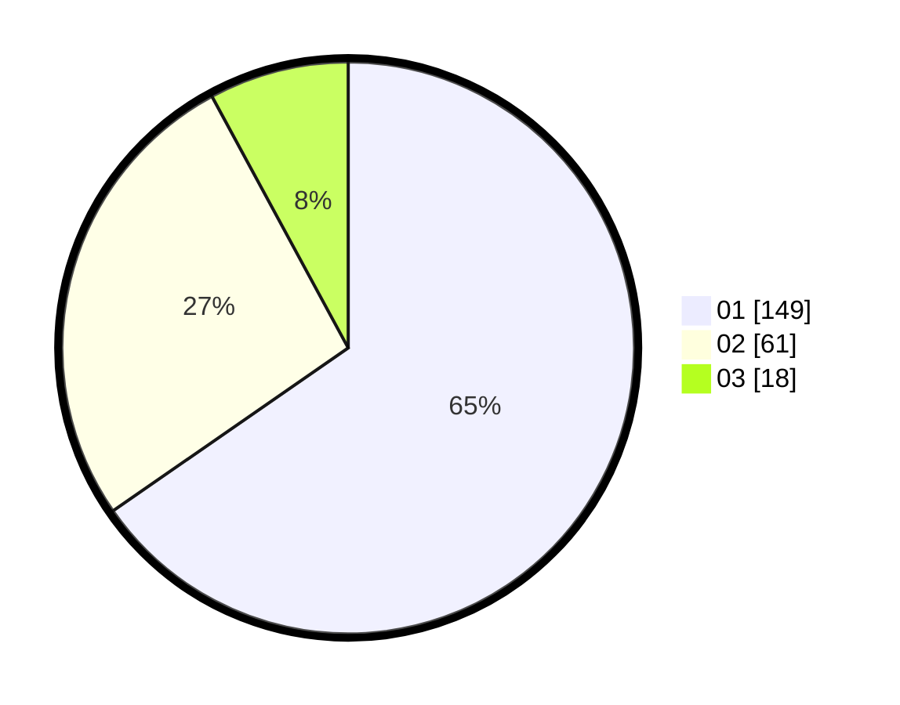

# Hasil

Hasil perolehan suara paslon dapat dilihat pada file paslon-01.txt, paslon-02.txt, dan paslon-03.txt.

Jika tidak ada, artinya data tersebut belum ada pada SIREKAP.

## Perolehan Suara

 * Paslon 01: **149**.
 * Paslon 02: **61**.
 * Paslon 03: **18**.

## Foto C Plano

https://sirekap-obj-formc.kpu.go.id/f3c3/pemilu/ppwp/31/75/02/10/02/3175021002027-20240214-212630--d9dbfb8f-a6a1-4a93-ac85-eb4c2d9bc88a.jpg

https://sirekap-obj-formc.kpu.go.id/f3c3/pemilu/ppwp/31/75/02/10/02/3175021002027-20240214-212831--9819e94d-8180-4d7a-993f-b8c2d893fc15.jpg

https://sirekap-obj-formc.kpu.go.id/f3c3/pemilu/ppwp/31/75/02/10/02/3175021002027-20240215-012644--0894165d-49f6-4de9-9b60-215c70885708.jpg
