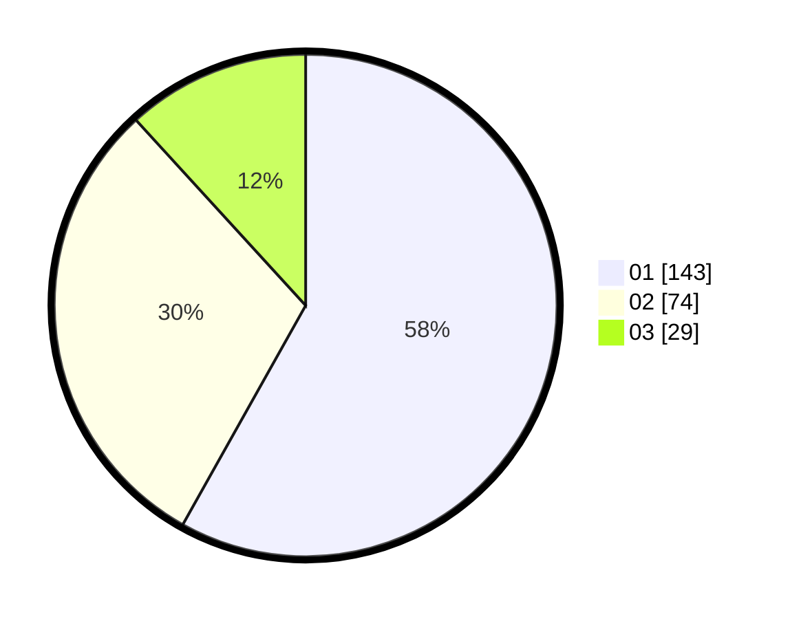

# Hasil

Hasil perolehan suara paslon dapat dilihat pada file paslon-01.txt, paslon-02.txt, dan paslon-03.txt.

Jika tidak ada, artinya data tersebut belum ada pada SIREKAP.

## Perolehan Suara

 * Paslon 01: **143**.
 * Paslon 02: **74**.
 * Paslon 03: **29**.

## Foto C Plano

https://sirekap-obj-formc.kpu.go.id/3077/pemilu/ppwp/31/75/02/10/02/3175021002028-20240216-052032--b21d9744-15da-46ec-8407-2e148f5af917.jpg

https://sirekap-obj-formc.kpu.go.id/3077/pemilu/ppwp/31/75/02/10/02/3175021002028-20240216-052034--8cbebf09-771f-4e7e-80c3-3fb2db35c09d.jpg

https://sirekap-obj-formc.kpu.go.id/3077/pemilu/ppwp/31/75/02/10/02/3175021002028-20240216-041617--77e5cbfd-095f-4f49-827f-cace37b6f311.jpg

## DATA PEMILIH TETAP

Jumlah pemilih dalam DPT: **0**.
 * L: **0**.
 * P: **0**.

## DATA PENGGUNA HAK PILIH

Jumlah pengguna hak pilih dalam DPT: **0**.
 * L: **0**.
 * P: **0**.

Jumlah pengguna hak pilih dalam DPTb: **0**.
 * L: **0**.
 * P: **0**.

Jumlah pengguna hak pilih dalam DPK: **0**.
 * L: **0**.
 * P: **0**.

Jumlah pengguna hak pilih: **0**.
 * L: **0**.
 * P: **0**.

## JUMLAH SUARA SAH DAN TIDAK SAH

JUMLAH SELURUH SUARA SAH: **246**.

JUMLAH SUARA TIDAK SAH: **2**.

JUMLAH SELURUH SUARA SAH DAN SUARA TIDAK SAH: **248**.
