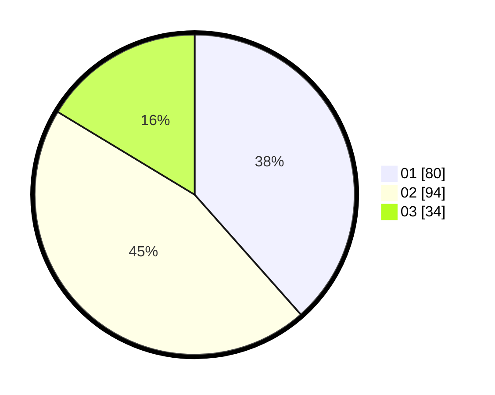

# Hasil

Hasil perolehan suara paslon dapat dilihat pada file paslon-01.txt, paslon-02.txt, dan paslon-03.txt.

Jika tidak ada, artinya data tersebut belum ada pada SIREKAP.

## Perolehan Suara

 * Paslon 01: **80**.
 * Paslon 02: **94**.
 * Paslon 03: **34**.

## Foto C Plano

https://sirekap-obj-formc.kpu.go.id/e960/pemilu/ppwp/31/75/02/10/02/3175021002031-20240215-033746--6ebc3f76-0c0e-41a4-8dd4-40ed847c161e.jpg

https://sirekap-obj-formc.kpu.go.id/e960/pemilu/ppwp/31/75/02/10/02/3175021002031-20240214-235829--ce4220b6-9504-43ab-968b-bde58dbff1b6.jpg

https://sirekap-obj-formc.kpu.go.id/e960/pemilu/ppwp/31/75/02/10/02/3175021002031-20240215-000006--9dfeef91-d0db-4cfa-9024-cc61f72cbcf0.jpg
