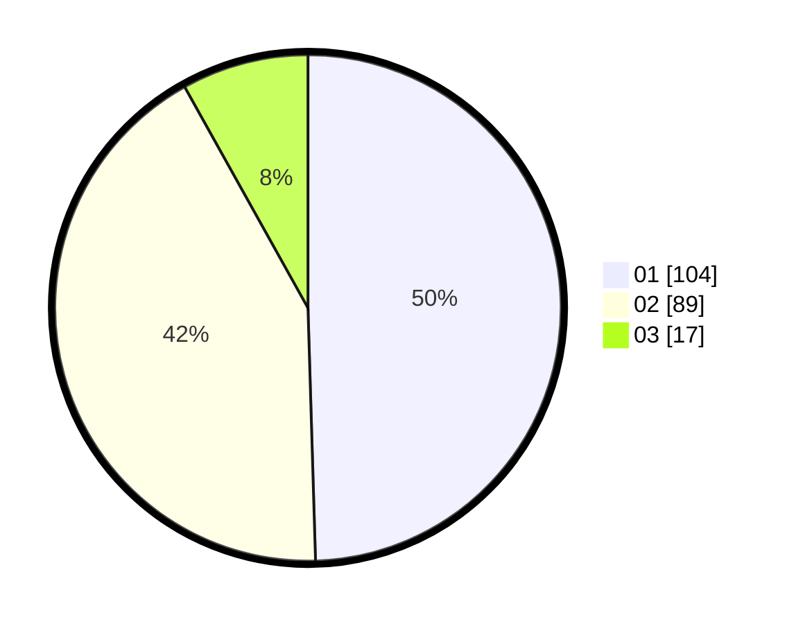

# Hasil

Hasil perolehan suara paslon dapat dilihat pada file paslon-01.txt, paslon-02.txt, dan paslon-03.txt.

Jika tidak ada, artinya data tersebut belum ada pada SIREKAP.

## Perolehan Suara

 * Paslon 01: **104**.
 * Paslon 02: **89**.
 * Paslon 03: **17**.

## Foto C Plano

https://sirekap-obj-formc.kpu.go.id/2d95/pemilu/ppwp/31/75/02/10/02/3175021002036-20240214-211443--4031a44c-aac7-4cc5-a301-fa2c6486cf6f.jpg

https://sirekap-obj-formc.kpu.go.id/2d95/pemilu/ppwp/31/75/02/10/02/3175021002036-20240214-211758--905c1d14-a6eb-492a-872c-dfa2900d8ad3.jpg

https://sirekap-obj-formc.kpu.go.id/2d95/pemilu/ppwp/31/75/02/10/02/3175021002036-20240214-212137--eb7feb6a-0a9a-46b5-84bc-b2d1152ea6ac.jpg

## DATA PEMILIH TETAP

Jumlah pemilih dalam DPT: **271**.
 * L: **134**.
 * P: **137**.

## DATA PENGGUNA HAK PILIH

Jumlah pengguna hak pilih dalam DPT: **212**.
 * L: **99**.
 * P: **113**.

Jumlah pengguna hak pilih dalam DPTb: **1**.
 * L: **0**.
 * P: **1**.

Jumlah pengguna hak pilih dalam DPK: **0**.
 * L: **0**.
 * P: **0**.

Jumlah pengguna hak pilih: **213**.
 * L: **99**.
 * P: **114**.

## JUMLAH SUARA SAH DAN TIDAK SAH

JUMLAH SELURUH SUARA SAH: **210**.

JUMLAH SUARA TIDAK SAH: **3**.

JUMLAH SELURUH SUARA SAH DAN SUARA TIDAK SAH: **213**.
