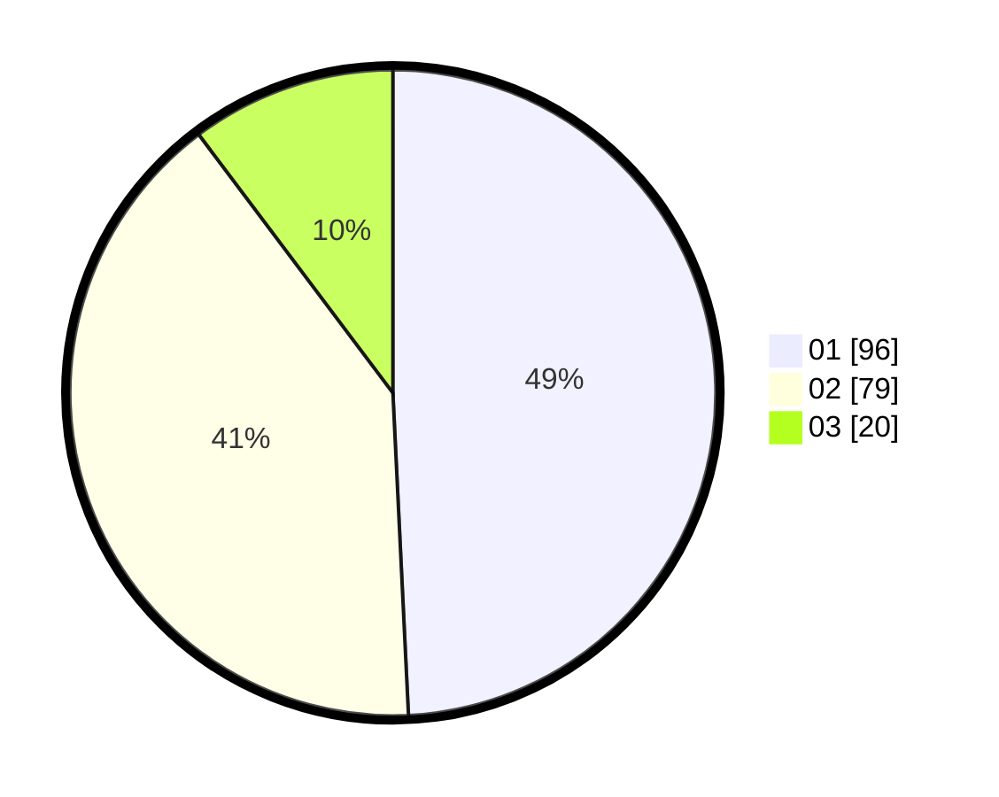

# Hasil

Hasil perolehan suara paslon dapat dilihat pada file paslon-01.txt, paslon-02.txt, dan paslon-03.txt.

Jika tidak ada, artinya data tersebut belum ada pada SIREKAP.

## Perolehan Suara

 * Paslon 01: **96**.
 * Paslon 02: **79**.
 * Paslon 03: **20**.

## Foto C Plano

https://sirekap-obj-formc.kpu.go.id/fc76/pemilu/ppwp/31/75/02/10/02/3175021002037-20240214-191953--b6130ebb-2230-40c6-a8a6-92ec7f7b77f7.jpg

https://sirekap-obj-formc.kpu.go.id/fc76/pemilu/ppwp/31/75/02/10/02/3175021002037-20240214-192936--8c804584-828b-40be-bf5d-2e9fe5668ffb.jpg

https://sirekap-obj-formc.kpu.go.id/fc76/pemilu/ppwp/31/75/02/10/02/3175021002037-20240214-192424--ca688477-9a46-4ea4-948a-769188b1d05b.jpg

## DATA PEMILIH TETAP

Jumlah pemilih dalam DPT: **271**.
 * L: **122**.
 * P: **149**.

## DATA PENGGUNA HAK PILIH

Jumlah pengguna hak pilih dalam DPT: **197**.
 * L: **90**.
 * P: **107**.

Jumlah pengguna hak pilih dalam DPTb: **1**.
 * L: **0**.
 * P: **1**.

Jumlah pengguna hak pilih dalam DPK: **0**.
 * L: **0**.
 * P: **0**.

Jumlah pengguna hak pilih: **198**.
 * L: **90**.
 * P: **108**.

## JUMLAH SUARA SAH DAN TIDAK SAH

JUMLAH SELURUH SUARA SAH: **195**.

JUMLAH SUARA TIDAK SAH: **3**.

JUMLAH SELURUH SUARA SAH DAN SUARA TIDAK SAH: **198**.
