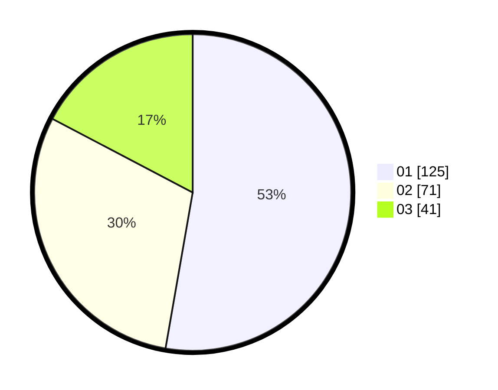

# Hasil

Hasil perolehan suara paslon dapat dilihat pada file paslon-01.txt, paslon-02.txt, dan paslon-03.txt.

Jika tidak ada, artinya data tersebut belum ada pada SIREKAP.

## Perolehan Suara

 * Paslon 01: **125**.
 * Paslon 02: **71**.
 * Paslon 03: **41**.

## Foto C Plano

https://sirekap-obj-formc.kpu.go.id/a9bc/pemilu/ppwp/31/75/02/10/02/3175021002041-20240214-190324--aa889ba9-bb92-490c-87b7-5f3eb5b7b144.jpg

https://sirekap-obj-formc.kpu.go.id/a9bc/pemilu/ppwp/31/75/02/10/02/3175021002041-20240214-155402--6f4799cb-936d-4a04-b6ea-82ed0bfb1d81.jpg

https://sirekap-obj-formc.kpu.go.id/a9bc/pemilu/ppwp/31/75/02/10/02/3175021002041-20240216-033952--776373b2-053e-4251-bd58-e311a56d6aa2.jpg

## DATA PEMILIH TETAP

Jumlah pemilih dalam DPT: **281**.
 * L: **137**.
 * P: **144**.

## DATA PENGGUNA HAK PILIH

Jumlah pengguna hak pilih dalam DPT: **231**.
 * L: **111**.
 * P: **120**.

Jumlah pengguna hak pilih dalam DPTb: **9**.
 * L: **4**.
 * P: **5**.

Jumlah pengguna hak pilih dalam DPK: **0**.
 * L: **0**.
 * P: **0**.

Jumlah pengguna hak pilih: **240**.
 * L: **115**.
 * P: **125**.

## JUMLAH SUARA SAH DAN TIDAK SAH

JUMLAH SELURUH SUARA SAH: **237**.

JUMLAH SUARA TIDAK SAH: **3**.

JUMLAH SELURUH SUARA SAH DAN SUARA TIDAK SAH: **240**.
