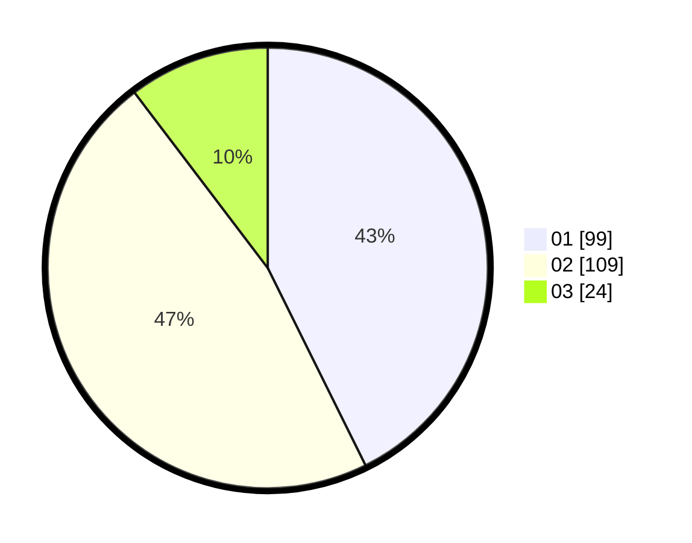

# Hasil

Hasil perolehan suara paslon dapat dilihat pada file paslon-01.txt, paslon-02.txt, dan paslon-03.txt.

Jika tidak ada, artinya data tersebut belum ada pada SIREKAP.

## Perolehan Suara

 * Paslon 01: **99**.
 * Paslon 02: **109**.
 * Paslon 03: **24**.

## Foto C Plano

https://sirekap-obj-formc.kpu.go.id/87eb/pemilu/ppwp/31/75/02/10/02/3175021002042-20240214-202750--dc0fd4ad-57d7-472a-8539-eaf1c2496f25.jpg

https://sirekap-obj-formc.kpu.go.id/87eb/pemilu/ppwp/31/75/02/10/02/3175021002042-20240214-202930--dc975d85-4b56-49ce-97c2-3711520db4de.jpg

https://sirekap-obj-formc.kpu.go.id/87eb/pemilu/ppwp/31/75/02/10/02/3175021002042-20240214-203057--38971fd9-fa18-41df-aab2-994467078857.jpg

## DATA PEMILIH TETAP

Jumlah pemilih dalam DPT: **289**.
 * L: **142**.
 * P: **147**.

## DATA PENGGUNA HAK PILIH

Jumlah pengguna hak pilih dalam DPT: **227**.
 * L: **106**.
 * P: **121**.

Jumlah pengguna hak pilih dalam DPTb: **9**.
 * L: **6**.
 * P: **3**.

Jumlah pengguna hak pilih dalam DPK: **0**.
 * L: **0**.
 * P: **0**.

Jumlah pengguna hak pilih: **236**.
 * L: **112**.
 * P: **124**.

## JUMLAH SUARA SAH DAN TIDAK SAH

JUMLAH SELURUH SUARA SAH: **232**.

JUMLAH SUARA TIDAK SAH: **4**.

JUMLAH SELURUH SUARA SAH DAN SUARA TIDAK SAH: **236**.
