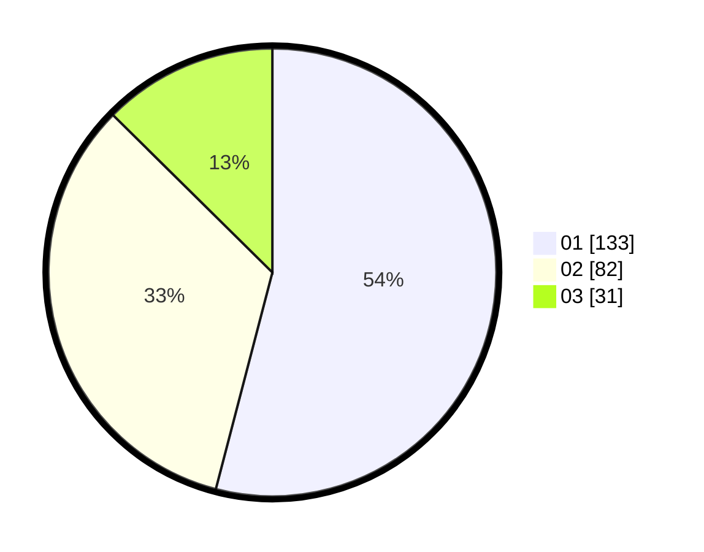

# Hasil

Hasil perolehan suara paslon dapat dilihat pada file paslon-01.txt, paslon-02.txt, dan paslon-03.txt.

Jika tidak ada, artinya data tersebut belum ada pada SIREKAP.

## Perolehan Suara

 * Paslon 01: **133**.
 * Paslon 02: **82**.
 * Paslon 03: **31**.

## Foto C Plano

https://sirekap-obj-formc.kpu.go.id/d58d/pemilu/ppwp/31/75/02/10/02/3175021002044-20240214-215039--39ff9adf-c133-4408-8345-db6983be46df.jpg

https://sirekap-obj-formc.kpu.go.id/d58d/pemilu/ppwp/31/75/02/10/02/3175021002044-20240214-205923--3cb7492a-a67c-4455-aa3e-f2329c89f570.jpg

https://sirekap-obj-formc.kpu.go.id/d58d/pemilu/ppwp/31/75/02/10/02/3175021002044-20240214-210040--c9bde4e3-65a2-4a04-94ea-953a17e70bf1.jpg
