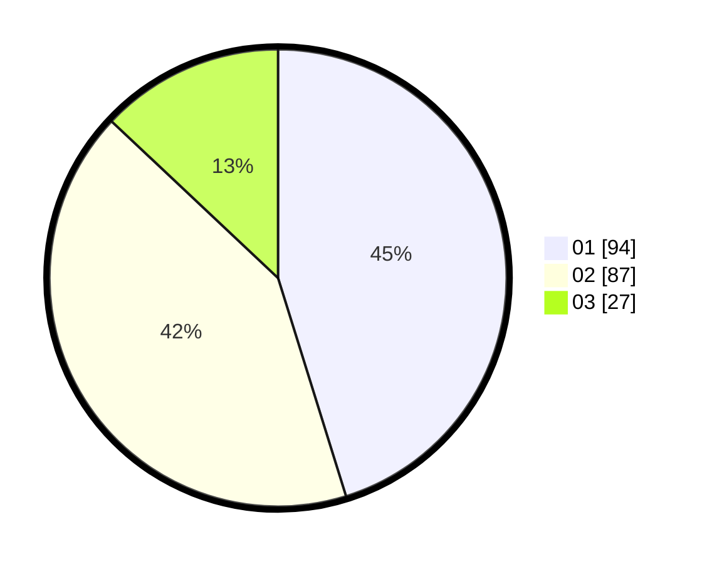

# Hasil

Hasil perolehan suara paslon dapat dilihat pada file paslon-01.txt, paslon-02.txt, dan paslon-03.txt.

Jika tidak ada, artinya data tersebut belum ada pada SIREKAP.

## Perolehan Suara

 * Paslon 01: **94**.
 * Paslon 02: **87**.
 * Paslon 03: **27**.

## Foto C Plano

https://sirekap-obj-formc.kpu.go.id/836c/pemilu/ppwp/31/75/02/10/02/3175021002047-20240215-014234--e76e9ad4-4b9d-4ed6-b7a7-e63fb5c3c9f8.jpg

https://sirekap-obj-formc.kpu.go.id/836c/pemilu/ppwp/31/75/02/10/02/3175021002047-20240215-014501--632a4b43-c363-4380-81aa-46e59287f91c.jpg

https://sirekap-obj-formc.kpu.go.id/836c/pemilu/ppwp/31/75/02/10/02/3175021002047-20240215-014641--683ff27f-7c0f-4af7-b63e-b8523bbfa808.jpg
