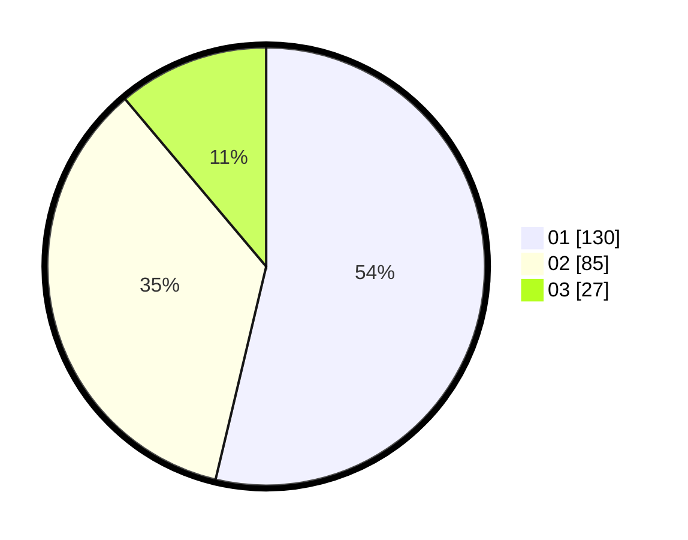

# Hasil

Hasil perolehan suara paslon dapat dilihat pada file paslon-01.txt, paslon-02.txt, dan paslon-03.txt.

Jika tidak ada, artinya data tersebut belum ada pada SIREKAP.

## Perolehan Suara

 * Paslon 01: **130**.
 * Paslon 02: **85**.
 * Paslon 03: **27**.

## Foto C Plano

https://sirekap-obj-formc.kpu.go.id/914b/pemilu/ppwp/31/75/02/10/02/3175021002049-20240214-221330--22e30c82-e5fc-41ba-9ced-120a3bf83d29.jpg

https://sirekap-obj-formc.kpu.go.id/914b/pemilu/ppwp/31/75/02/10/02/3175021002049-20240214-221525--000685e0-c899-4311-8036-199d44c929e7.jpg

https://sirekap-obj-formc.kpu.go.id/914b/pemilu/ppwp/31/75/02/10/02/3175021002049-20240214-221658--51323541-e7a8-46d0-b241-e27c967d166a.jpg
