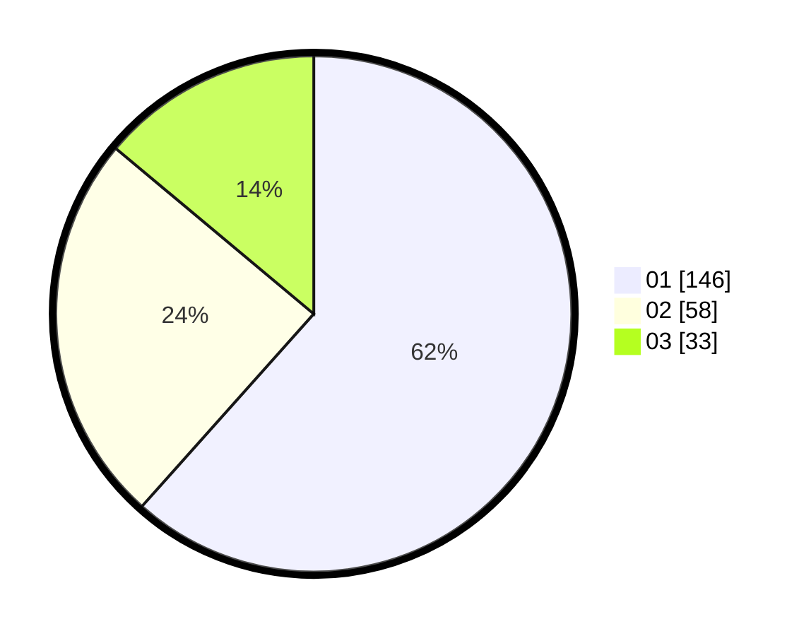

# Hasil

Hasil perolehan suara paslon dapat dilihat pada file paslon-01.txt, paslon-02.txt, dan paslon-03.txt.

Jika tidak ada, artinya data tersebut belum ada pada SIREKAP.

## Perolehan Suara

 * Paslon 01: **146**.
 * Paslon 02: **58**.
 * Paslon 03: **33**.

## Foto C Plano

https://sirekap-obj-formc.kpu.go.id/3918/pemilu/ppwp/31/75/02/10/02/3175021002053-20240215-004545--6981d212-5d1c-4011-9c4b-1b4fd029915a.jpg

https://sirekap-obj-formc.kpu.go.id/3918/pemilu/ppwp/31/75/02/10/02/3175021002053-20240215-004627--1b114149-aa57-4e2d-b3df-da58f709d939.jpg

https://sirekap-obj-formc.kpu.go.id/3918/pemilu/ppwp/31/75/02/10/02/3175021002053-20240215-004655--28a67d28-db05-4dab-850f-70dcb9ecbcaf.jpg
