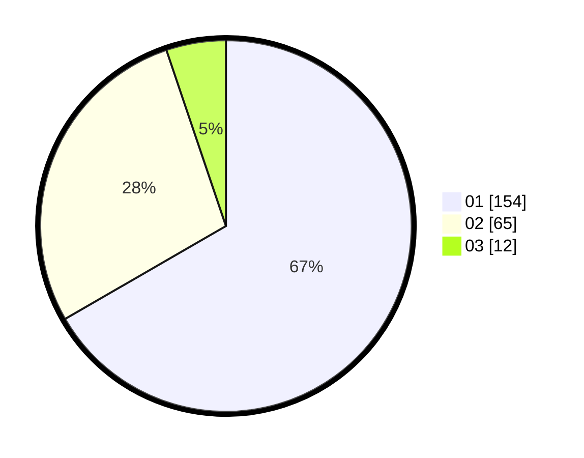

# Hasil

Hasil perolehan suara paslon dapat dilihat pada file paslon-01.txt, paslon-02.txt, dan paslon-03.txt.

Jika tidak ada, artinya data tersebut belum ada pada SIREKAP.

## Perolehan Suara

 * Paslon 01: **154**.
 * Paslon 02: **65**.
 * Paslon 03: **12**.

## Foto C Plano

https://sirekap-obj-formc.kpu.go.id/1dd8/pemilu/ppwp/31/75/02/10/02/3175021002055-20240214-211122--5ab41e0a-e871-4a17-bf7a-779b513ca2f2.jpg

https://sirekap-obj-formc.kpu.go.id/1dd8/pemilu/ppwp/31/75/02/10/02/3175021002055-20240214-211224--d52c27a1-5a0f-4863-ad7a-3e0195fef519.jpg

https://sirekap-obj-formc.kpu.go.id/1dd8/pemilu/ppwp/31/75/02/10/02/3175021002055-20240214-211331--25155c5f-f54e-4559-bf63-3f38997edb2a.jpg

## DATA PEMILIH TETAP

Jumlah pemilih dalam DPT: **266**.
 * L: **137**.
 * P: **129**.

## DATA PENGGUNA HAK PILIH

Jumlah pengguna hak pilih dalam DPT: **224**.
 * L: **112**.
 * P: **112**.

Jumlah pengguna hak pilih dalam DPTb: **9**.
 * L: **5**.
 * P: **4**.

Jumlah pengguna hak pilih dalam DPK: **1**.
 * L: **1**.
 * P: **0**.

Jumlah pengguna hak pilih: **234**.
 * L: **118**.
 * P: **116**.

## JUMLAH SUARA SAH DAN TIDAK SAH

JUMLAH SELURUH SUARA SAH: **231**.

JUMLAH SUARA TIDAK SAH: **3**.

JUMLAH SELURUH SUARA SAH DAN SUARA TIDAK SAH: **234**.
