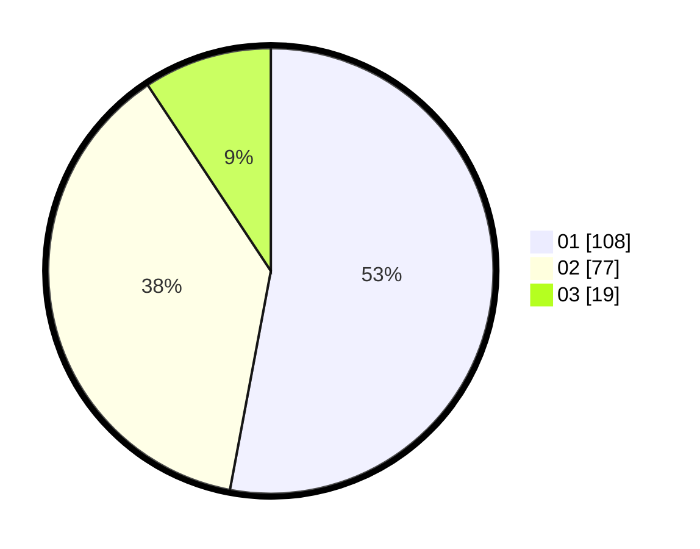

# Hasil

Hasil perolehan suara paslon dapat dilihat pada file paslon-01.txt, paslon-02.txt, dan paslon-03.txt.

Jika tidak ada, artinya data tersebut belum ada pada SIREKAP.

## Perolehan Suara

 * Paslon 01: **108**.
 * Paslon 02: **77**.
 * Paslon 03: **19**.

## Foto C Plano

https://sirekap-obj-formc.kpu.go.id/c997/pemilu/ppwp/31/75/02/10/02/3175021002057-20240214-175322--8eb1e90e-ec24-4f85-a9b9-99d1168b1646.jpg

https://sirekap-obj-formc.kpu.go.id/c997/pemilu/ppwp/31/75/02/10/02/3175021002057-20240216-181800--5a941018-d94b-4731-88fb-3770c0cffee3.jpg

https://sirekap-obj-formc.kpu.go.id/c997/pemilu/ppwp/31/75/02/10/02/3175021002057-20240216-181800--c000534c-060a-4f81-8276-203ed40540b5.jpg

## DATA PEMILIH TETAP

Jumlah pemilih dalam DPT: **263**.
 * L: **127**.
 * P: **136**.

## DATA PENGGUNA HAK PILIH

Jumlah pengguna hak pilih dalam DPT: **208**.
 * L: **92**.
 * P: **116**.

Jumlah pengguna hak pilih dalam DPTb: **2**.
 * L: **0**.
 * P: **2**.

Jumlah pengguna hak pilih dalam DPK: **0**.
 * L: **0**.
 * P: **0**.

Jumlah pengguna hak pilih: **210**.
 * L: **92**.
 * P: **118**.

## JUMLAH SUARA SAH DAN TIDAK SAH

JUMLAH SELURUH SUARA SAH: **204**.

JUMLAH SUARA TIDAK SAH: **6**.

JUMLAH SELURUH SUARA SAH DAN SUARA TIDAK SAH: **210**.
