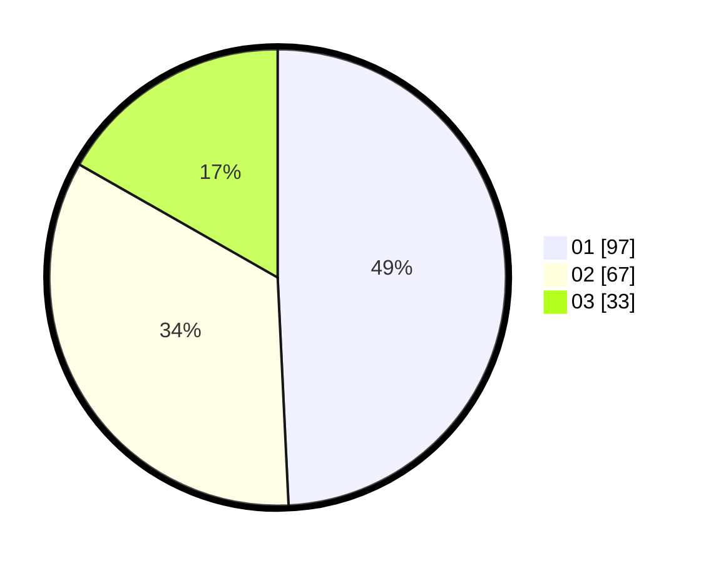

# Hasil

Hasil perolehan suara paslon dapat dilihat pada file paslon-01.txt, paslon-02.txt, dan paslon-03.txt.

Jika tidak ada, artinya data tersebut belum ada pada SIREKAP.

## Perolehan Suara

 * Paslon 01: **97**.
 * Paslon 02: **67**.
 * Paslon 03: **33**.

## Foto C Plano

https://sirekap-obj-formc.kpu.go.id/a86d/pemilu/ppwp/31/75/02/10/02/3175021002059-20240214-211518--a915eab6-54b6-4f48-bf0d-d5b522999ea2.jpg

https://sirekap-obj-formc.kpu.go.id/a86d/pemilu/ppwp/31/75/02/10/02/3175021002059-20240214-211605--f5c0ba1a-4899-4b0b-9e3b-4da19c9b22e9.jpg

https://sirekap-obj-formc.kpu.go.id/a86d/pemilu/ppwp/31/75/02/10/02/3175021002059-20240214-211352--09916b4a-1d1f-45db-8be0-b34408a82469.jpg

## DATA PEMILIH TETAP

Jumlah pemilih dalam DPT: **265**.
 * L: **130**.
 * P: **175**.

## DATA PENGGUNA HAK PILIH

Jumlah pengguna hak pilih dalam DPT: **147**.
 * L: **46**.
 * P: **102**.

Jumlah pengguna hak pilih dalam DPTb: **0**.
 * L: **0**.
 * P: **0**.

Jumlah pengguna hak pilih dalam DPK: **0**.
 * L: **0**.
 * P: **0**.

Jumlah pengguna hak pilih: **177**.
 * L: **44**.
 * P: **102**.

## JUMLAH SUARA SAH DAN TIDAK SAH

JUMLAH SELURUH SUARA SAH: **197**.

JUMLAH SUARA TIDAK SAH: **1**.

JUMLAH SELURUH SUARA SAH DAN SUARA TIDAK SAH: **198**.
