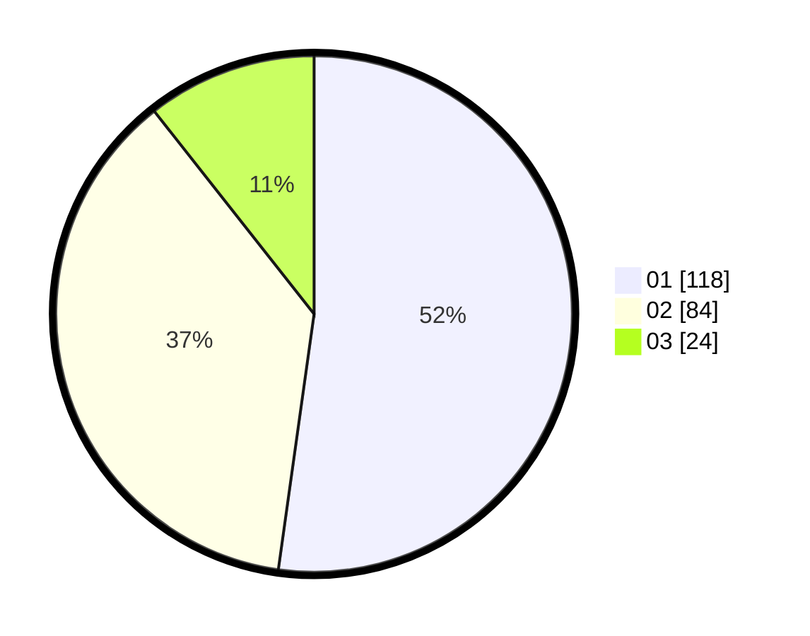

# Hasil

Hasil perolehan suara paslon dapat dilihat pada file paslon-01.txt, paslon-02.txt, dan paslon-03.txt.

Jika tidak ada, artinya data tersebut belum ada pada SIREKAP.

## Perolehan Suara

 * Paslon 01: **118**.
 * Paslon 02: **84**.
 * Paslon 03: **24**.

## Foto C Plano

https://sirekap-obj-formc.kpu.go.id/5c10/pemilu/ppwp/31/75/02/10/02/3175021002060-20240216-132352--26941938-9b23-486a-8de3-5020eed70fd0.jpg

https://sirekap-obj-formc.kpu.go.id/5c10/pemilu/ppwp/31/75/02/10/02/3175021002060-20240216-132354--67ed9e69-766c-45c5-bd0f-6203cd0eb184.jpg

https://sirekap-obj-formc.kpu.go.id/5c10/pemilu/ppwp/31/75/02/10/02/3175021002060-20240216-132353--4e623295-919c-428b-b618-b879d3809869.jpg

## DATA PEMILIH TETAP

Jumlah pemilih dalam DPT: **267**.
 * L: **129**.
 * P: **138**.

## DATA PENGGUNA HAK PILIH

Jumlah pengguna hak pilih dalam DPT: **225**.
 * L: **106**.
 * P: **119**.

Jumlah pengguna hak pilih dalam DPTb: **1**.
 * L: **0**.
 * P: **1**.

Jumlah pengguna hak pilih dalam DPK: **1**.
 * L: **0**.
 * P: **1**.

Jumlah pengguna hak pilih: **227**.
 * L: **106**.
 * P: **121**.

## JUMLAH SUARA SAH DAN TIDAK SAH

JUMLAH SELURUH SUARA SAH: **226**.

JUMLAH SUARA TIDAK SAH: **1**.

JUMLAH SELURUH SUARA SAH DAN SUARA TIDAK SAH: **227**.
