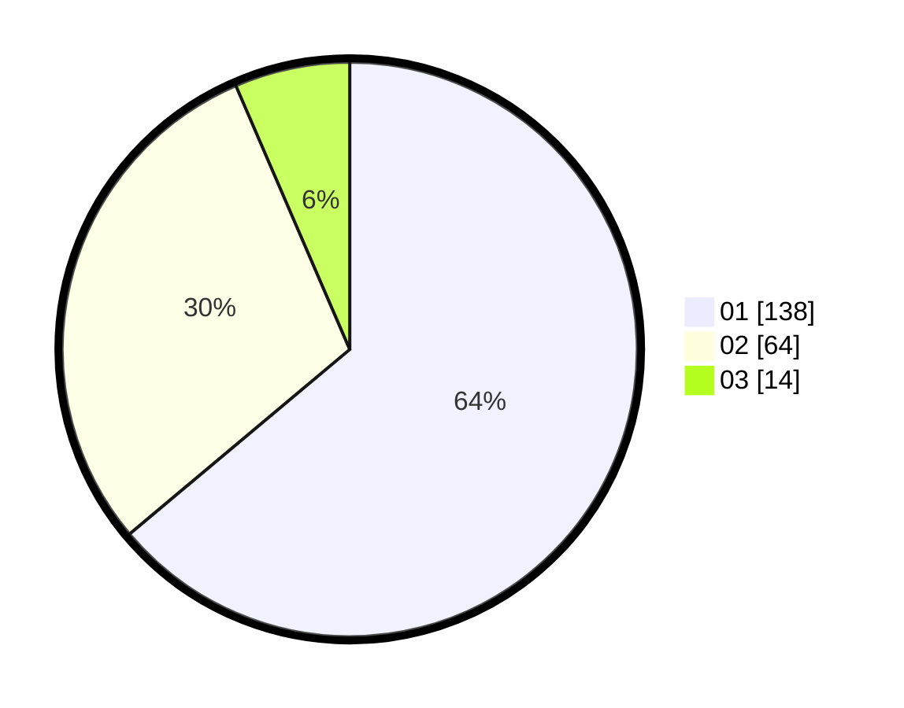

# Hasil

Hasil perolehan suara paslon dapat dilihat pada file paslon-01.txt, paslon-02.txt, dan paslon-03.txt.

Jika tidak ada, artinya data tersebut belum ada pada SIREKAP.

## Perolehan Suara

 * Paslon 01: **138**.
 * Paslon 02: **64**.
 * Paslon 03: **14**.

## Foto C Plano

https://sirekap-obj-formc.kpu.go.id/e616/pemilu/ppwp/31/75/02/10/02/3175021002065-20240214-214757--d6bd7eec-5532-4198-9b52-0c79a3357692.jpg

https://sirekap-obj-formc.kpu.go.id/e616/pemilu/ppwp/31/75/02/10/02/3175021002065-20240214-215326--a27a44b5-de98-42a9-a98e-0ce945bd27c1.jpg

https://sirekap-obj-formc.kpu.go.id/e616/pemilu/ppwp/31/75/02/10/02/3175021002065-20240214-223031--25b1db0e-05b7-4d0c-a541-33dba4cdaebd.jpg
