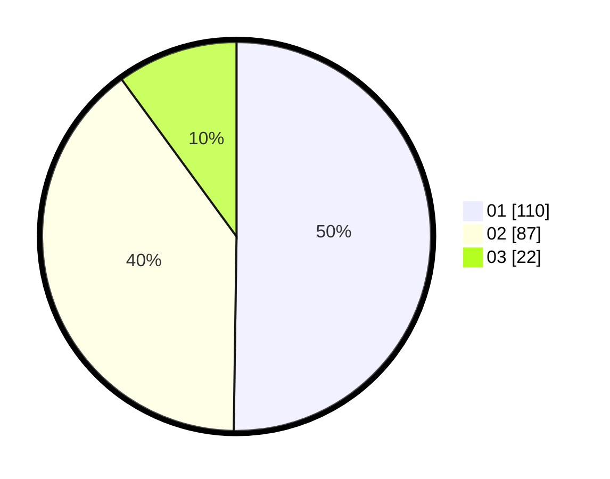

# Hasil

Hasil perolehan suara paslon dapat dilihat pada file paslon-01.txt, paslon-02.txt, dan paslon-03.txt.

Jika tidak ada, artinya data tersebut belum ada pada SIREKAP.

## Perolehan Suara

 * Paslon 01: **110**.
 * Paslon 02: **87**.
 * Paslon 03: **22**.

## Foto C Plano

https://sirekap-obj-formc.kpu.go.id/98ee/pemilu/ppwp/31/75/02/10/02/3175021002066-20240215-020933--9275eefc-4fa8-4da7-ab40-2afacf011ad3.jpg

https://sirekap-obj-formc.kpu.go.id/98ee/pemilu/ppwp/31/75/02/10/02/3175021002066-20240215-021026--3f0a4f4d-a2ab-4957-98cc-de4582833cc8.jpg
