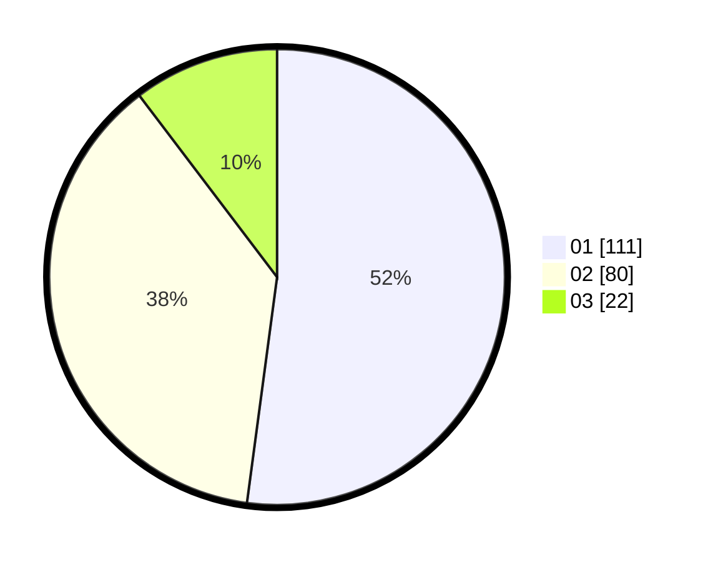

# Hasil

Hasil perolehan suara paslon dapat dilihat pada file paslon-01.txt, paslon-02.txt, dan paslon-03.txt.

Jika tidak ada, artinya data tersebut belum ada pada SIREKAP.

## Perolehan Suara

 * Paslon 01: **111**.
 * Paslon 02: **80**.
 * Paslon 03: **22**.

## Foto C Plano

https://sirekap-obj-formc.kpu.go.id/d693/pemilu/ppwp/31/75/02/10/02/3175021002068-20240214-185854--072cd74a-2c08-4f99-a571-cbe762bbb1fd.jpg

https://sirekap-obj-formc.kpu.go.id/d693/pemilu/ppwp/31/75/02/10/02/3175021002068-20240215-081049--989e0f85-c6d7-4867-8e08-ebac7d173c82.jpg

https://sirekap-obj-formc.kpu.go.id/d693/pemilu/ppwp/31/75/02/10/02/3175021002068-20240214-190154--23887598-b2ee-4139-bd45-dad8b7e49bf8.jpg

## DATA PEMILIH TETAP

Jumlah pemilih dalam DPT: **260**.
 * L: **133**.
 * P: **127**.

## DATA PENGGUNA HAK PILIH

Jumlah pengguna hak pilih dalam DPT: **205**.
 * L: **104**.
 * P: **101**.

Jumlah pengguna hak pilih dalam DPTb: **8**.
 * L: **5**.
 * P: **3**.

Jumlah pengguna hak pilih dalam DPK: **1**.
 * L: **0**.
 * P: **1**.

Jumlah pengguna hak pilih: **214**.
 * L: **109**.
 * P: **105**.

## JUMLAH SUARA SAH DAN TIDAK SAH

JUMLAH SELURUH SUARA SAH: **213**.

JUMLAH SUARA TIDAK SAH: **1**.

JUMLAH SELURUH SUARA SAH DAN SUARA TIDAK SAH: **214**.
