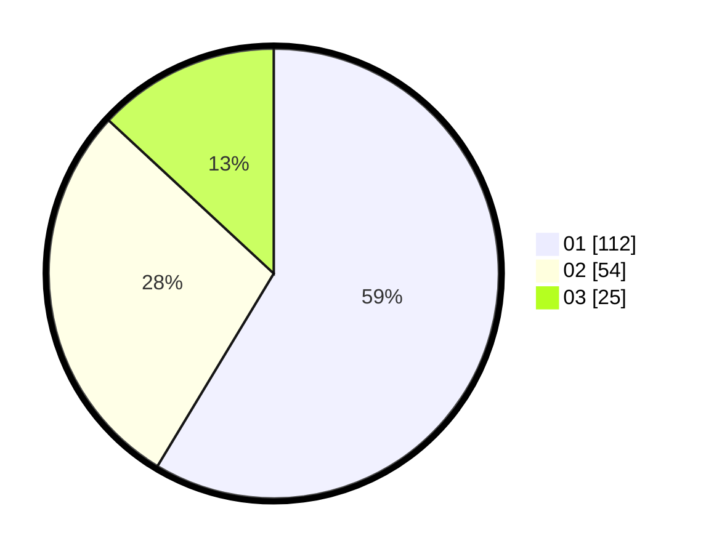

# Hasil

Hasil perolehan suara paslon dapat dilihat pada file paslon-01.txt, paslon-02.txt, dan paslon-03.txt.

Jika tidak ada, artinya data tersebut belum ada pada SIREKAP.

## Perolehan Suara

 * Paslon 01: **112**.
 * Paslon 02: **54**.
 * Paslon 03: **25**.

## Foto C Plano

https://sirekap-obj-formc.kpu.go.id/8612/pemilu/ppwp/31/75/02/10/02/3175021002070-20240214-201615--ea3a25fc-5b35-47d0-861b-6c45816cdcf9.jpg

https://sirekap-obj-formc.kpu.go.id/8612/pemilu/ppwp/31/75/02/10/02/3175021002070-20240214-201836--91fe7b23-4d92-407b-9c6f-9e68c67e71c1.jpg

https://sirekap-obj-formc.kpu.go.id/8612/pemilu/ppwp/31/75/02/10/02/3175021002070-20240214-214403--4d5f16d4-94d5-4ba3-921a-0c0a47bcb4bc.jpg
