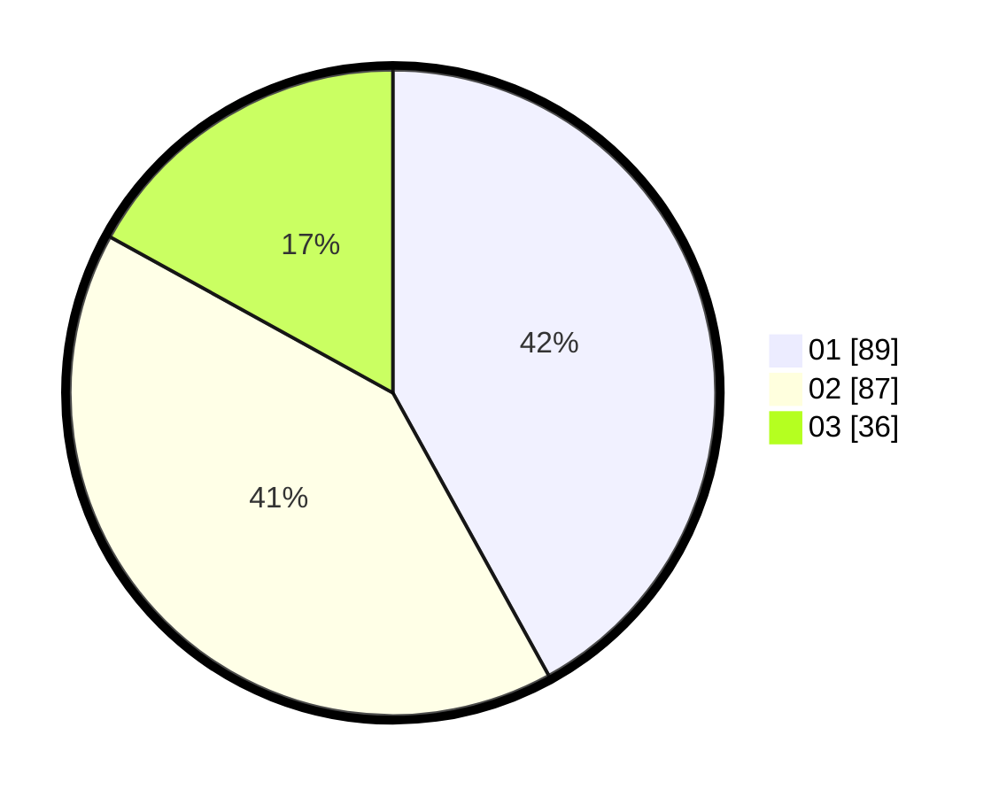

# Hasil

Hasil perolehan suara paslon dapat dilihat pada file paslon-01.txt, paslon-02.txt, dan paslon-03.txt.

Jika tidak ada, artinya data tersebut belum ada pada SIREKAP.

## Perolehan Suara

 * Paslon 01: **89**.
 * Paslon 02: **87**.
 * Paslon 03: **36**.

## Foto C Plano

https://sirekap-obj-formc.kpu.go.id/abe3/pemilu/ppwp/31/75/02/10/02/3175021002071-20240214-155139--e3cfe707-a124-4228-8f0a-e193ebd4034b.jpg

https://sirekap-obj-formc.kpu.go.id/abe3/pemilu/ppwp/31/75/02/10/02/3175021002071-20240214-155848--39fc1bd7-6c17-415e-b293-61500192771a.jpg

https://sirekap-obj-formc.kpu.go.id/abe3/pemilu/ppwp/31/75/02/10/02/3175021002071-20240214-192801--ca18e88c-7bfd-438d-ae3b-4f545be5a7cc.jpg

## DATA PEMILIH TETAP

Jumlah pemilih dalam DPT: **257**.
 * L: **125**.
 * P: **132**.

## DATA PENGGUNA HAK PILIH

Jumlah pengguna hak pilih dalam DPT: **215**.
 * L: **95**.
 * P: **120**.

Jumlah pengguna hak pilih dalam DPTb: **4**.
 * L: **4**.
 * P: **0**.

Jumlah pengguna hak pilih dalam DPK: **0**.
 * L: **0**.
 * P: **0**.

Jumlah pengguna hak pilih: **219**.
 * L: **99**.
 * P: **120**.

## JUMLAH SUARA SAH DAN TIDAK SAH

JUMLAH SELURUH SUARA SAH: **212**.

JUMLAH SUARA TIDAK SAH: **7**.

JUMLAH SELURUH SUARA SAH DAN SUARA TIDAK SAH: **219**.
