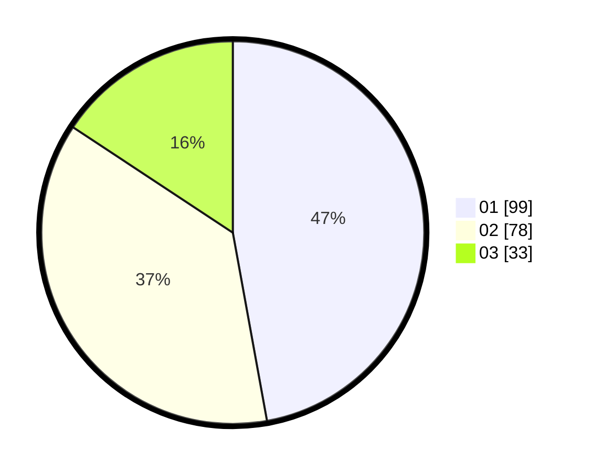

# Hasil

Hasil perolehan suara paslon dapat dilihat pada file paslon-01.txt, paslon-02.txt, dan paslon-03.txt.

Jika tidak ada, artinya data tersebut belum ada pada SIREKAP.

## Perolehan Suara

 * Paslon 01: **99**.
 * Paslon 02: **78**.
 * Paslon 03: **33**.

## Foto C Plano

https://sirekap-obj-formc.kpu.go.id/e400/pemilu/ppwp/31/75/02/10/02/3175021002072-20240214-184431--62aae5ee-122b-462f-aa9d-0ad42cc63322.jpg

https://sirekap-obj-formc.kpu.go.id/e400/pemilu/ppwp/31/75/02/10/02/3175021002072-20240214-184539--da86cd83-38f9-40b3-9194-4e581647500d.jpg

https://sirekap-obj-formc.kpu.go.id/e400/pemilu/ppwp/31/75/02/10/02/3175021002072-20240214-184621--3d09d096-d548-4fd1-a154-9972e9366b4e.jpg

## DATA PEMILIH TETAP

Jumlah pemilih dalam DPT: **262**.
 * L: **126**.
 * P: **136**.

## DATA PENGGUNA HAK PILIH

Jumlah pengguna hak pilih dalam DPT: **210**.
 * L: **100**.
 * P: **110**.

Jumlah pengguna hak pilih dalam DPTb: **0**.
 * L: **0**.
 * P: **0**.

Jumlah pengguna hak pilih dalam DPK: **2**.
 * L: **0**.
 * P: **2**.

Jumlah pengguna hak pilih: **212**.
 * L: **100**.
 * P: **112**.

## JUMLAH SUARA SAH DAN TIDAK SAH

JUMLAH SELURUH SUARA SAH: **210**.

JUMLAH SUARA TIDAK SAH: **2**.

JUMLAH SELURUH SUARA SAH DAN SUARA TIDAK SAH: **212**.
