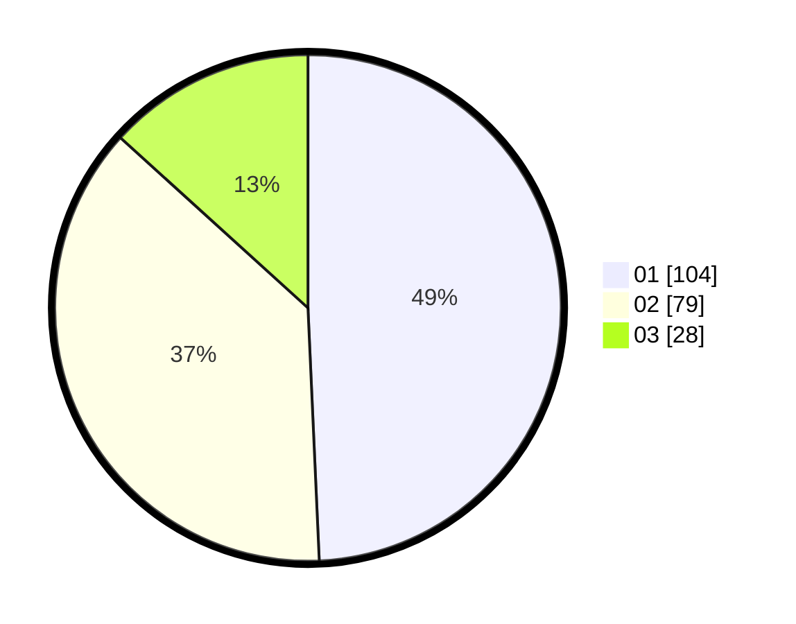

# Hasil

Hasil perolehan suara paslon dapat dilihat pada file paslon-01.txt, paslon-02.txt, dan paslon-03.txt.

Jika tidak ada, artinya data tersebut belum ada pada SIREKAP.

## Perolehan Suara

 * Paslon 01: **104**.
 * Paslon 02: **79**.
 * Paslon 03: **28**.

## Foto C Plano

https://sirekap-obj-formc.kpu.go.id/b3fd/pemilu/ppwp/31/75/02/10/02/3175021002077-20240214-201711--4b0482b6-0f77-4e0b-9dd0-dbb98472008d.jpg

https://sirekap-obj-formc.kpu.go.id/b3fd/pemilu/ppwp/31/75/02/10/02/3175021002077-20240214-201807--95009dbb-10bd-4aed-899d-fcca31ea5574.jpg

https://sirekap-obj-formc.kpu.go.id/b3fd/pemilu/ppwp/31/75/02/10/02/3175021002077-20240214-201841--4e20c520-7339-43ba-aa1f-d54bb4d53e1f.jpg

## DATA PEMILIH TETAP

Jumlah pemilih dalam DPT: **263**.
 * L: **136**.
 * P: **127**.

## DATA PENGGUNA HAK PILIH

Jumlah pengguna hak pilih dalam DPT: **209**.
 * L: **108**.
 * P: **101**.

Jumlah pengguna hak pilih dalam DPTb: **6**.
 * L: **3**.
 * P: **3**.

Jumlah pengguna hak pilih dalam DPK: **0**.
 * L: **0**.
 * P: **0**.

Jumlah pengguna hak pilih: **215**.
 * L: **111**.
 * P: **104**.

## JUMLAH SUARA SAH DAN TIDAK SAH

JUMLAH SELURUH SUARA SAH: **211**.

JUMLAH SUARA TIDAK SAH: **4**.

JUMLAH SELURUH SUARA SAH DAN SUARA TIDAK SAH: **215**.
