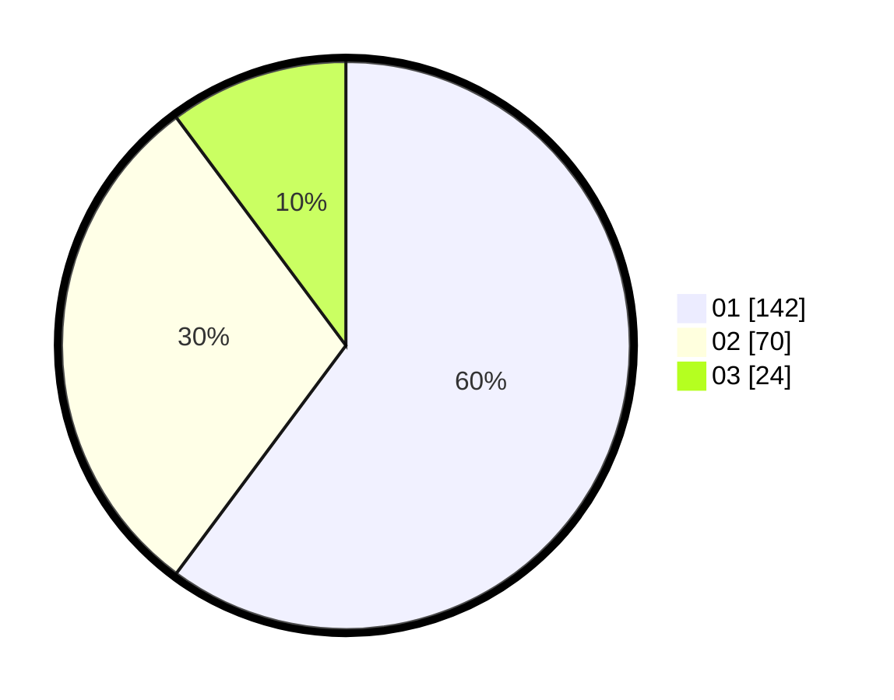

# Hasil

Hasil perolehan suara paslon dapat dilihat pada file paslon-01.txt, paslon-02.txt, dan paslon-03.txt.

Jika tidak ada, artinya data tersebut belum ada pada SIREKAP.

## Perolehan Suara

 * Paslon 01: **142**.
 * Paslon 02: **70**.
 * Paslon 03: **24**.

## Foto C Plano

https://sirekap-obj-formc.kpu.go.id/c261/pemilu/ppwp/31/75/02/10/02/3175021002081-20240214-211553--16e5d1c8-cd98-4ae8-9ea6-e0d365662b36.jpg

https://sirekap-obj-formc.kpu.go.id/c261/pemilu/ppwp/31/75/02/10/02/3175021002081-20240214-211801--903992c6-1029-4db2-aeb6-c33093482ee6.jpg

https://sirekap-obj-formc.kpu.go.id/c261/pemilu/ppwp/31/75/02/10/02/3175021002081-20240214-212050--e3cef05b-41f3-462c-9fe2-55d421682ece.jpg
