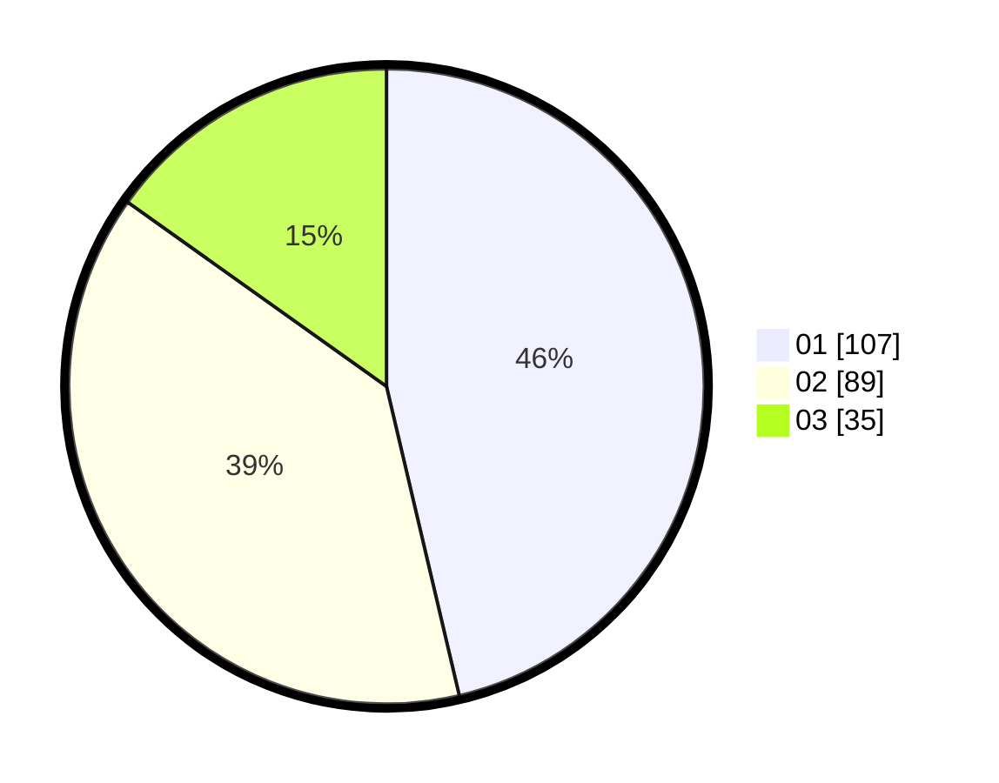

# Hasil

Hasil perolehan suara paslon dapat dilihat pada file paslon-01.txt, paslon-02.txt, dan paslon-03.txt.

Jika tidak ada, artinya data tersebut belum ada pada SIREKAP.

## Perolehan Suara

 * Paslon 01: **107**.
 * Paslon 02: **89**.
 * Paslon 03: **35**.

## Foto C Plano

https://sirekap-obj-formc.kpu.go.id/a240/pemilu/ppwp/31/75/02/10/02/3175021002088-20240215-232711--b30d441f-3379-43de-84d5-243993962b53.jpg

https://sirekap-obj-formc.kpu.go.id/a240/pemilu/ppwp/31/75/02/10/02/3175021002088-20240215-232714--05c75cf1-0beb-4973-a989-8c5388ad26e4.jpg

https://sirekap-obj-formc.kpu.go.id/a240/pemilu/ppwp/31/75/02/10/02/3175021002088-20240215-232712--751a53fc-5622-4652-880b-a5ad6d5791c5.jpg

## DATA PEMILIH TETAP

Jumlah pemilih dalam DPT: **279**.
 * L: **133**.
 * P: **146**.

## DATA PENGGUNA HAK PILIH

Jumlah pengguna hak pilih dalam DPT: **230**.
 * L: **109**.
 * P: **121**.

Jumlah pengguna hak pilih dalam DPTb: **5**.
 * L: **3**.
 * P: **2**.

Jumlah pengguna hak pilih dalam DPK: **0**.
 * L: **0**.
 * P: **0**.

Jumlah pengguna hak pilih: **235**.
 * L: **112**.
 * P: **123**.

## JUMLAH SUARA SAH DAN TIDAK SAH

JUMLAH SELURUH SUARA SAH: **231**.

JUMLAH SUARA TIDAK SAH: **4**.

JUMLAH SELURUH SUARA SAH DAN SUARA TIDAK SAH: **235**.
