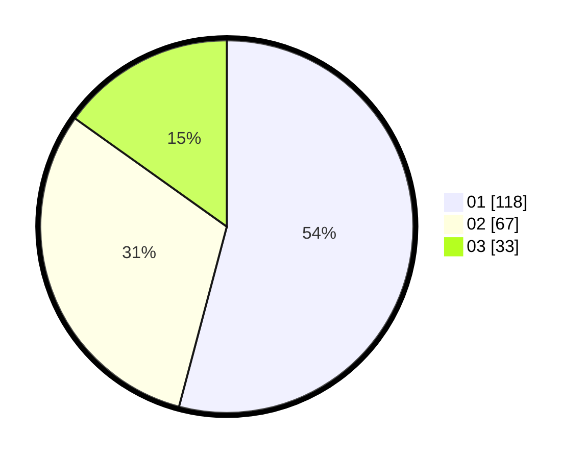

# Hasil

Hasil perolehan suara paslon dapat dilihat pada file paslon-01.txt, paslon-02.txt, dan paslon-03.txt.

Jika tidak ada, artinya data tersebut belum ada pada SIREKAP.

## Perolehan Suara

 * Paslon 01: **118**.
 * Paslon 02: **67**.
 * Paslon 03: **33**.

## Foto C Plano

https://sirekap-obj-formc.kpu.go.id/3c77/pemilu/ppwp/31/75/02/10/02/3175021002090-20240216-031320--9de637d6-f439-4077-9a50-e0b04ead89f9.jpg

https://sirekap-obj-formc.kpu.go.id/3c77/pemilu/ppwp/31/75/02/10/02/3175021002090-20240216-031321--70f736d8-4f73-4add-8a98-9ee79169d05b.jpg

https://sirekap-obj-formc.kpu.go.id/3c77/pemilu/ppwp/31/75/02/10/02/3175021002090-20240216-031320--55db0e71-3ee4-4587-9a96-ef38ce558ab9.jpg

## DATA PEMILIH TETAP

Jumlah pemilih dalam DPT: **270**.
 * L: **125**.
 * P: **145**.

## DATA PENGGUNA HAK PILIH

Jumlah pengguna hak pilih dalam DPT: **214**.
 * L: **96**.
 * P: **118**.

Jumlah pengguna hak pilih dalam DPTb: **4**.
 * L: **3**.
 * P: **1**.

Jumlah pengguna hak pilih dalam DPK: **1**.
 * L: **0**.
 * P: **1**.

Jumlah pengguna hak pilih: **219**.
 * L: **99**.
 * P: **120**.

## JUMLAH SUARA SAH DAN TIDAK SAH

JUMLAH SELURUH SUARA SAH: **218**.

JUMLAH SUARA TIDAK SAH: **1**.

JUMLAH SELURUH SUARA SAH DAN SUARA TIDAK SAH: **219**.
