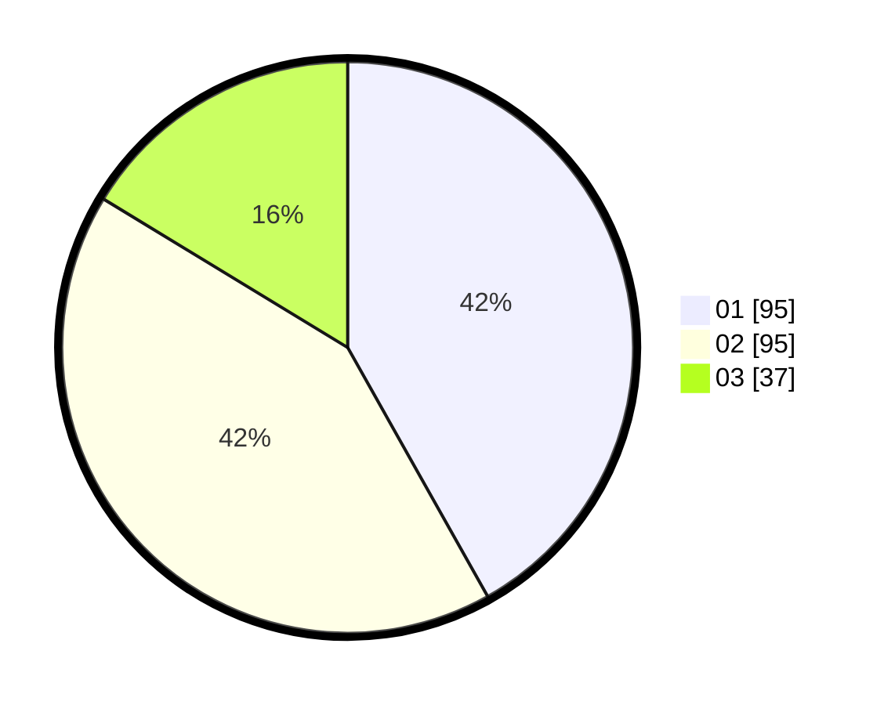

# Hasil

Hasil perolehan suara paslon dapat dilihat pada file paslon-01.txt, paslon-02.txt, dan paslon-03.txt.

Jika tidak ada, artinya data tersebut belum ada pada SIREKAP.

## Perolehan Suara

 * Paslon 01: **95**.
 * Paslon 02: **95**.
 * Paslon 03: **37**.

## Foto C Plano

https://sirekap-obj-formc.kpu.go.id/b3ba/pemilu/ppwp/31/75/02/10/02/3175021002091-20240214-200433--c47abd19-bef3-4095-9ef5-7660c687d454.jpg

https://sirekap-obj-formc.kpu.go.id/b3ba/pemilu/ppwp/31/75/02/10/02/3175021002091-20240214-200428--489727ee-5233-4413-a654-cabd41faa706.jpg

https://sirekap-obj-formc.kpu.go.id/b3ba/pemilu/ppwp/31/75/02/10/02/3175021002091-20240214-200440--3f57153a-5e91-4a6c-addb-2536544e8377.jpg

## DATA PEMILIH TETAP

Jumlah pemilih dalam DPT: **285**.
 * L: **144**.
 * P: **141**.

## DATA PENGGUNA HAK PILIH

Jumlah pengguna hak pilih dalam DPT: **225**.
 * L: **108**.
 * P: **117**.

Jumlah pengguna hak pilih dalam DPTb: **5**.
 * L: **3**.
 * P: **2**.

Jumlah pengguna hak pilih dalam DPK: **1**.
 * L: **0**.
 * P: **1**.

Jumlah pengguna hak pilih: **231**.
 * L: **111**.
 * P: **120**.

## JUMLAH SUARA SAH DAN TIDAK SAH

JUMLAH SELURUH SUARA SAH: **227**.

JUMLAH SUARA TIDAK SAH: **4**.

JUMLAH SELURUH SUARA SAH DAN SUARA TIDAK SAH: **231**.
